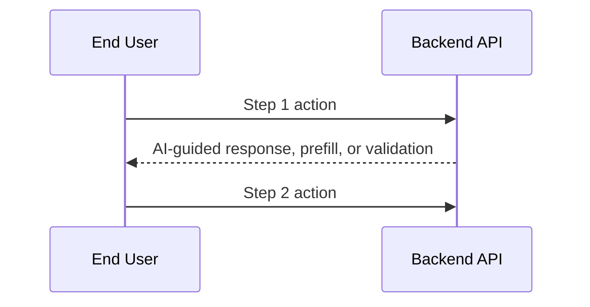

---
description: Start Gofer, confirm EAI readiness, and orchestrate the unified pipeline
---

# Gofer Start

## Continuation And Stop Contract
<!-- gofer:continuation:start -->

1. Preserve the requested scope and mode, including read-only, plan-only, research-only and MVP work. Keep the full applicable pipeline, stage functions, artifacts, reviews and validation; do not expand an MVP into an unapproved release.
2. After a stage's required evidence is complete, read and follow the next internal file in .specify/commands/ in the same conversation. Do not require a numbered command or a host-specific skill dispatcher. Optional helpers remain optional; maintenance and control commands do not start delivery work.
3. After explicit business-specification approval, continue routine planning, tasks, implementation and validation within that approved scope. Record the approval source and scope; missing or ambiguous approval is not approval. A proposal or generated status is not user consent.
4. Preserve any explicit plan/task approval requirement unless it is already satisfied by recorded user approval covering that work. Rejected, revoked, changed or unclear approval requires a pause. Never invent approvedBy, approvedAt or a new approval event when reusing an existing approval.
5. Pause for material scope, security, cost, deployment, destructive or protected files/boundary changes and any outstanding user gate. Business approval does not authorize publishing, spending, external changes or bypassing host permissions. Complete safe authorized work without bypassing the blocked gate.
6. A tool proposal is not execution. If host consent is required, wait for it. After the tool result or approved proposal returns, inspect the result and resume the next authorized action within approved scope; do not end with only a plan or a proposed tool call. A denied tool or unavailable capability must not be bypassed through another host or CLI.
7. Use the current agent's available native tools. Optional Gofer/MCP tools are conveniences, not prerequisites. If the current agent lacks a required capability, report that limitation and the safe next action; do not pretend a handoff button transfers control automatically.
8. Stop after research only when research-only work was requested, the user paused, or a real gate blocks progress. Otherwise continue to specification. At validation, report completion only when the requested scope's required evidence passes; failures remain unfinished work.
9. Respect budget, context and retry limits from the existing loop contract. Repair safe within-scope failures only within those limits. Preserve a checkpoint before an orderly context stop; resume by reading its recorded stage and rechecking scope, approvals and evidence. Never claim an abrupt host termination was handled.
10. Report concise Progress during work. At every controlled stop, report Progress, Stop reason and Next action, including the exact missing input or approval and unfinished work. Reasons are requested scope complete, user pause, approval required, material change, missing capability/access, validation blocked, or budget/context/retry limit. Stage completion alone is not pipeline completion.

**Blocker Mediation**

- Before repeating a failed action or asking for missing input, read .specify/references/blocker-mediation.md and inspect the private blocker register with gofer-blocker-control.mjs. Reuse the same state directory and goal, subject and condition keys across stages, restarts and surfaces. Different wording, models or tools do not create a new blocker.
- Classify the cause first. Missing user decisions, access, external dependencies and unavailable capabilities require a recorded wait. Reserve an ask event before asking; ask once, explain the business impact and required change, then stop affected work. An unanswered question is not new evidence. Do not poll or rephrase it to keep running.
- Technical ask events require a fresh verification file under .specify/references/priority-outcome-protection.md: actual diagnosis, self-cause check and why no authorized repair is available. Business choices need no failed command. For feature tasks, use gofer-priority-check.mjs and the saved direction before switching work; this does not start delivery during maintenance or conversation.
- For AI-solvable or unknown causes, reserve each attempt before execution. Allow one investigation and one different recovery within existing tighter budgets. Record its result even when interrupted or unsuccessful. An unfinished reservation must not launch again. Do not reset the register, change keys or switch surfaces to obtain more attempts.
- Resume only after a real user answer or changed external evidence has been recorded and checked. The helper allows one evidence-backed resumption; exhausted limits need human review. Never invent approval or evidence. Successful model output and a running server do not resolve a blocker without the relevant check.
- Save the blocker, unfinished tasks and next action before stopping. Continue only approved tasks that do not depend on it. Keep the original goal; update specs, plans, tasks and validation for accepted direction changes, and reopen stale checks. Do not quietly drop requirements to make progress.
- Use node .specify/scripts/node/gofer-blocker-control.mjs --state-dir <private-state-directory> --event <private-event.json> before controlled actions; inspect with --state-dir alone, or add --task T001 for an independent task. A denied action, invalid record or missing helper means stop and explain the limitation, not bypass it. Use the installed plugin script path if no repo scaffold exists. Conversation-only work uses a private session state directory and does not require app setup or feature files.
- Strict loop validation checks every recorded feature blocker. Shared instructions guide native chats; this helper cannot intercept calls that a host sends directly. Do not claim native enforcement from package tests alone.
<!-- gofer:continuation:end -->

## Token And Cost Policy
<!-- gofer:token-cost-policy:start -->

Before spawning agents, calling tools, or loading large files:

1. Treat `.specify/memory/gofer-model-policy.yaml` as the repo-owned source of truth for simple, medium, hard, and arbiter model routing. If it is missing, run `/gofer:bootstrap-workspace` before continuing.
2. Use the cheapest capable model first.
   - Claude: Haiku for scouting/extraction; Sonnet for normal implementation, synthesis, validation, and security; Opus for high-risk arbitration or release-critical failures.
   - Codex/OpenAI: GPT mini for simple coding; GPT nano only for locate/classify/summarize/mechanical work; GPT-5.3-Codex or flagship GPT for tool-heavy coding, architecture, and release-critical validation.
   - Gemini: Flash-Lite for cheap large-context scan/summarize; Flash for default research synthesis; Pro for large-context architecture or high-risk arbitration.
   - Copilot: prefer Auto for simple and default work; ask the user before choosing a paid/high-tier picker model for hard security, architecture, or release gates.
3. Keep raw tool output out of the main conversation context. Save stable findings to `.specify/specs/{feature}/context-bundle.md`, then work from summaries.
4. Use provider prompt/context caching only for stable, non-secret prefixes: Gofer scaffold, AGENTS/CLAUDE/Copilot instructions, constitution, repo map, stage contracts, and validation rubric.
5. Before continuing after large research, planning, implementation, or validation bursts, checkpoint the durable artifacts and compact/clear/resume context when the host supports it.
6. Escalate model tier only when a cheaper pass is low-confidence, contradictory, security-sensitive, or blocking release quality.
<!-- gofer:token-cost-policy:end -->

## Business-Friendly Progress Contract
<!-- gofer:business-progress:start -->

Default user-facing updates must be concise, business-level, and easy to scan.
Keep the technical work rigorous in artifacts, tests, logs, and code, but do
not lead with implementation jargon unless the user asks for it.

Use ASD-STE100 Simplified Technical English as the target writing standard for
all Gofer-authored chat, documents, commands, summaries, PR notes, error
guidance, and validation artifacts. ASD-STE100 is copyright and a trademark of
ASD; do not bundle the protected ASD dictionary and do not claim ASD
certification.

1. Explain progress as what is being connected, changed, checked, or fixed and
   why it matters to the business outcome.
2. Use the running build map: create or update
   `.specify/specs/{feature}/build-map.md` from
   `.specify/templates/build-map-template.md` for application delivery, and
   refer to its plain-language areas in progress updates.
3. When there is a problem, translate it into business impact, current status,
   next action, and what input or approval is needed. Keep raw stack traces,
   command logs, IDs, and acronyms out of chat unless asked.
4. If the user asks for technical depth, provide it on request and point to the
   durable artifact that contains the evidence.
5. Prefer a compact update shape:
   - `Working on`: the build-map area or stakeholder outcome
   - `Why it matters`: user/business impact
   - `Status`: done, checking, fixing, blocked, or needs decision
6. Use one action per instruction.
7. Keep instructions to 20 words or fewer where possible.
8. Use active voice unless the actor is unknown or not important.
9. Use simple verb forms: simple present, simple past, simple future,
   infinitive, or imperative.
10. Define acronyms on first use and use approved project terms.
11. Avoid idioms, marketing adjectives, vague praise, and hedging.
12. Use vertical lists for complex information and one topic per paragraph.
13. For errors, state what happened, why it matters, what to do next, and the
    exact safe command when one exists.
14. Do not remove technical validation, security checks, EAI preflights, tests,
   or loop evidence. This contract changes presentation, not engineering
   standards.
15. Before each user-facing reply, check that it leads with the business effect,
    uses concise simple language, and includes only useful technical detail.
16. If any check fails, rewrite the reply before sending it.
**Business Updates And Goal Checks**

Use `.specify/references/business-updates-and-goal-checks.md`. Before each reply, explain the result, business effect, and next action in plain language. For progress, use two or three short sentences. Run `node .specify/scripts/node/gofer-response-check.mjs --input <private-draft-file>` before sending a drafted progress update; rewrite failed drafts. Use `--kind answer` for answers and `--technical` only when technical detail was requested. Do not repeat unchanged progress. This helper cannot intercept messages that the host sends directly.

Before each work batch, read the current goal, specification, tasks, and latest findings. After new knowledge or an approved change, update affected feature documents and explain the effect. Never weaken acceptance criteria to match failing code or invent user approval. Mark a task complete only after its linked checks pass; reopen affected tasks when evidence is stale. For app and non-app features with a spec and tasks, enable `requireDeliveryCheckpoint` in `loop-contract.json` and run `node .specify/scripts/node/gofer-delivery-check.mjs --feature-dir <feature-dir>` before advancing or claiming completion. Follow the reference to capture a reviewed checkpoint, not merely to clear a failure. Keep existing MVP exemptions, reviews, loops, and release gates. Conversation-only requests need no feature files.

**Priority And Outcome Protection**

Follow `.specify/references/priority-outcome-protection.md`. Before implementing a task, record the latest material user direction in decisions.md and maintain priority-plan.json with ordered tasks, dependencies, allowedEditScope and the current outcome. Enable requirePriorityPlan for new feature contracts. Run `node .specify/scripts/node/gofer-priority-check.mjs --feature-dir <feature-dir> --task T001` before the action, and include --workspace <repo-root> plus --changed-file for each proposed or actual changed repo-relative path. Follow its nextTask; only recorded prerequisites and approved parallel work may precede the current priority. Do not switch to unrelated work when blocked. On resume, state the agreed outcome and next task in plain language after reading the last recorded direction. Keep routine conversation free of feature paperwork.

Before technical escalation, attach fresh diagnosis through the blocker helper's ask event verification field. Check the exact command, route, environment, own mistake and existing authority. Do not invent a tenant, ask for login without checking it, require an unsafe alternative, or equate administrator access with permission. Business decisions need no failing command. At completion, run the priority checker with --finish; a missing or stale outcome receipt means unverified, regardless of test scores. Use --completion for the final gofer-closed-loop-audit.mjs run; a routine drift audit alone does not prove completion. Preserve detailed test results, early local MVP scope, non-app work, independent approved tasks and all release/security checks.

<!-- gofer:business-progress:end -->

## App Preview Runner Contract
<!-- gofer:app-preview-runner:start -->

For EAI app delivery, every UI preview must use the repo runner when it exists.

1. Use `./run.sh dev 3001` on macOS, Linux, and GitHub Codespaces.
2. Use `run.bat dev 3001` on Windows.
3. Use a different port only when the feature notes record the reason.
4. Restart only this app. Before stopping a process, verify its exact checkout, process ID, start time and command, then recheck immediately before stopping it. Never stop another app, an unknown process, or every process on a port. If ownership is uncertain, leave it running and ask the user. Inspect older runners before use; do not run one that kills by port alone.
5. Do not use direct `npm run dev`, `next dev`, or package-manager preview commands when `run.sh`, `run.bat`, or `run.ps1` exists.
6. After every UI-facing change, run:
   - `node .specify/scripts/node/gofer-ui-preview.mjs --feature-dir {FEATURE_DIR} --command "./run.sh dev 3001" --open auto --screenshot --change "<change summary>"`
7. On Windows, use:
   - `node .specify/scripts/node/gofer-ui-preview.mjs --feature-dir {FEATURE_DIR} --command "run.bat dev 3001" --open auto --screenshot --change "<change summary>"`
8. If the runner is missing in an EAI app template repo, refresh the template before preview work continues.
9. Check the exact preview page and the current implemented user journey after each change. A running process, open browser, screenshot alone, error page or dry run is not proof that it works. Say ready to view only after those checks pass. Otherwise explain what is unchecked or failing; do not claim readiness. Record fresh browser and test evidence. Local MVP checks cover only implemented behaviour; do not add future auth or deployment gates. Keep showing clearly labelled drafts without adding approval stops.
<!-- gofer:app-preview-runner:end -->

## Always-On EAI Contract

Users usually start every request with `/eai`, `$eai`, or `#eai`. Treat that
prefix as activation for this contract, not as business content.

1. Apply the Controlled English Contract to every Gofer-authored message and
   artifact.
2. Keep the reply short unless the user asks for detail.
3. Explain the business effect first.
4. Put technical evidence in durable artifacts.
5. Do not make the user choose pipeline stages. Select the next internal stage
   yourself.

## Journey State

Before routing work, decide where the user is now.

1. Read current feature state from `.specify/specs/`, `goal-ledger.json`,
   `eai-preflight.md`, `research.md`, `spec.md`, `plan.md`, `tasks.md`,
   validation reports, loop evidence, and handoff notes when they exist.
2. Classify the request as conversation, research/docs/audit, EAI app delivery,
   or ambiguous.
3. For conversation or research/docs/audit, continue the non-app Gofer path
   after the one required non-app confirmation.
4. For EAI app delivery or ambiguous app work, continue directly into EAI
   readiness.
5. Find the earliest missing pipeline artifact or blocked EAI gate.
6. Run that internal stage next, then continue forward.
7. Keep the user-facing explanation at the business level.

## Delivery Lineage Contract

Before completing this stage, read `.specify/references/delivery-lineage.md`
and create or update
`.specify/specs/{feature}/delivery-lineage.json`. Gofer is customer-side: the
manifest must be a separately compiled `customer` graph that stops at published
PublicAPI capability nodes and contains no private EAI records.

## Workspace Preflight

Before doing stage/helper work:

1. Resolve the repository root.
2. Check the core Gofer sentinels:
   - `.specify/.gofer-version`
   - `.specify/commands/0_gofer_start.md`
   - `.specify/templates/spec-template.md`
   - `.specify/templates/build-map-template.md`
   - `.specify/templates/loop-contract-template.json`
   - `.specify/scripts/bash/create-new-feature.sh`
   - `.specify/scripts/node/parse-stage-command.mjs`
   - `.specify/scripts/node/gofer-loop-audit.mjs`
   - `.specify/scripts/node/gofer-ui-preview.mjs`
   - `.specify/scripts/hooks/post-tool-use.mjs`
   - `.specify/scripts/powershell/install-optional-tools.ps1`
   - `.specify/templates/gofer-model-policy.yaml`
   - `.specify/memory/gofer-model-policy.yaml`
   - `.specify/specs/`
   - `.specify/memory/`
3. Check host-specific repo-owned files when relevant:
   - Claude: `AGENTS.md`, `CLAUDE.md`, `.claude/settings.json`
   - Codex: `AGENTS.md`
   - Copilot: `.github/copilot-instructions.md`
   - VS Code extension mirrors Claude/Copilot/Gemini resources itself and should still keep the core scaffold healthy
4. If the repo already has the workspace checker script, prefer running:
   - `node .specify/scripts/node/gofer-workspace-check.mjs --host auto --json`
5. If the workspace is missing or stale, ask exactly:
   - **"This repo is missing or stale for Gofer. Initialize/update it now?"**
6. If the user says yes, run the Gofer workspace bootstrap helper and then resume this command from the top.
7. If the user says no, stop and explain that Gofer stage/helper work depends on the repo-owned scaffold.

## Local Settings Cleanup Contract
<!-- gofer:local-settings-cleanup:start -->

After any Gofer install, update, release refresh, or workspace bootstrap:

1. Archive stale Gofer command and skill entries before continuing.
2. Prefer the repo helper:
   - `node .specify/scripts/node/gofer-local-settings-cleanup.mjs --workspace . --apply --json`
3. If the repo helper is missing, use the stable plugin bundle helper:
   - macOS/Linux: `node ~/plugins/eai-gofer/.specify/scripts/node/gofer-local-settings-cleanup.mjs --workspace . --apply --json`
   - Windows: `node %USERPROFILE%\plugins\eai-gofer\.specify\scripts\node\gofer-local-settings-cleanup.mjs --workspace . --apply --json`
4. This cleanup covers old Claude, Codex, Copilot, Gemini, Grok, VS Code, desktop, and CLI command surfaces.
5. Do not remove the current public `eai` entrypoint.
6. Ask the user to refresh or restart the host command picker only after cleanup completes.
<!-- gofer:local-settings-cleanup:end -->

## MVP Capability-Based Validation

Use `.specify/references/mvp-capability-validation.md` as the source of
truth. Validate the work that the active feature specification requires now.
Do not apply later delivery requirements to an early MVP.

1. Create `.specify/specs/{feature}/` before app or operator-tool source work.
2. Keep `spec.md`, `plan.md`, `tasks.md`, `traceability.md`, and the validation scope aligned.
3. Mark each relevant capability as `not_applicable`, `planned`, `implemented`, `verified`, or `blocked`.
4. Require evidence only for an implemented capability or a capability required by the current delivery decision.
5. Treat `run.sh`, `run.bat`, and `run.ps1` as launch evidence only. They do not prove authentication, sessions, EAI access, or deployment readiness.
6. For a user-facing change, store the local HTTP check, screenshot, and review outcome in the feature validation report.
7. If browser validation is blocked, mark that user journey `unverified`. Do not call it complete.
8. If the user changes scope, update the feature artifacts before continuing. Explain what changed, what remains valid, and what now needs evidence.
9. Use truthful completion language. For example: `The server runs. Authentication is not in the current MVP scope.`
10. When the feature claims a release or deployed outcome, create `release-capability-ledger.md` from `.specify/templates/release-capability-ledger-template.md`.
11. Do not report a release complete or score 100% when a required capability is missing from traceability, remains on an open PR, is absent from the release branch, or lacks required deployed evidence.

## Application Classification And EAI Preflight

Before any EAI CLI, login, tenant, template, or app-enrollment action:

1. Classify the request as **EAI app delivery** or **non-application work** using the application signals in `.specify/commands/0_gofer_start.md`.
2. Create `.specify/specs/{feature}/` and record the active delivery scope before app or operator-tool source work.
3. If the request is clearly non-app work, confirm once: **"This looks like non-app work, so I will skip EAI tenant/app setup and continue the Gofer research/docs path. Is that right?"**
4. If the user confirms non-app, record the decision and mark app-only capabilities `not_applicable`. Do not run `eai whoami`, `eai tenant select`, `eai init`, or `/gofer:eai-first-run`.
5. For local MVP app work, validate the implemented user journey, repo runner, and preview evidence. Do not require EAI setup, authentication, or deployment when the active specification does not require them.
6. When the feature uses EAI Platform services, requires a tenant, or prepares deployment, run `eai whoami` and record the EAI readiness evidence in `eai-preflight.md`.
7. When the feature creates, changes, or validates an EAI Platform app integration, run `node .specify/scripts/node/eai-app-template-readiness.mjs --root . --json`. A missing checker or status other than `ready` blocks that EAI capability. It does not block unrelated local MVP work.
8. When authentication is implemented or required, validate provider, callback, sign-in, session, first protected API call, and safe denied access.
9. When deployment is requested or claimed, require the relevant EAI template, security, configuration, and deployment evidence before completion.
10. For durable app delivery, use EAI Platform first, Azure second, and every other stack only by explicit exception.
11. If the user changes scope, update `spec.md`, `plan.md`, `tasks.md`, `traceability.md`, and validation scope before continuing. Explain the business effect and evidence change.
12. Do not accept copied marker files, partial scaffolds, or custom templates as readiness evidence for an EAI capability.
13. Do not write tokens, secrets, private tenant IDs, or local `.env` values into Gofer artifacts; record only product-safe readiness status and evidence.

**Authentication Access Decision**

When adding or changing authentication, read `.specify/references/platform/eai-auth-access.md`. Ask: **"Who should be able to use this app: only members of its EAI workspace (recommended), or any authenticated EAI user?"** Default to `workspace-only`. Wait for the answer before changing auth code. An unanswered question must not widen access. Preserve stricter existing rules. Record the answer in the feature spec; do not repeat a confirmed question unless its scope changes.

Confirm the sign-in method separately: EAI sign-in or client SSO through EAI. Verify platform support and CLI syntax; do not invent SSO commands. Enforce trusted server-side workspace membership and app permissions. A session, CIAM directory ID, or email domain alone is not workspace access. Platform-wide sign-in never grants access to another workspace's data. Test allowed and denied users, revoked membership, unavailable membership checks, and cross-tenant requests. These checks apply only when authentication is implemented or required, not to non-app work or an auth-free local MVP.

## EAI App Delivery Preflight

Run this when the active feature requires EAI Platform services, a tenant,
authentication, an EAI app integration, or deployment. Do not run it for
explicit non-app work or an early local MVP that does not yet include those
capabilities. Record deferred EAI capabilities as `planned`, not as failures.
When an EAI capability enters scope, App delivery in EAI Gofer means EAI Platform delivery by default. If the user asks for a non-EAI app stack, pause
and confirm that they are intentionally leaving the EAI Gofer app-delivery path
before continuing.

Use current public EAI documentation as the safe source of truth:

- EAI CLI docs: `https://eai-support.github.io/eai/docs/overview`
- EAI API reference: `https://eai-support.github.io/eai/docs/api-reference`
- EAI static registry: `https://eai-support.github.io/eai/registry/`
- EAI scenario library: `https://eai-support.github.io/eai/scenarios`
- EAI app template: `https://github.com/eai-support/eai-app-template`

### EAI Platform And Azure App Stack Policy

For application delivery, Gofer MUST use this stack order:

1. **EAI Platform first, including the EAI app template**: EAI app template, EAI
   CLI, PublicAPI, object types, workflows, block catalog, ResourceAPI/resource
   schema, tenant/app enrollment, identity, provisioning, diagnostics, and
   documented EAI platform services are one EAI Platform app substrate.
2. **Azure second**: Azure services that are already part of, documented for, or
   compatible with the EAI Platform operating model, especially deployment,
   identity, storage, observability, and integration services.
3. **Everything else only by explicit exception**: Firebase, Supabase, Vercel as
   the primary runtime, AWS, GCP, bespoke backends, unmanaged databases, or
   unrelated SaaS platforms must not be recommended as the primary app substrate.
   They may appear only as integration targets, migration references, or
   approved exceptions with rationale, owner, expiry, and validation evidence.

Application-specific logic, adapters, UI extensions, and tests belong inside the
EAI Platform/EAI app template scaffold and must obey package-profile,
public-readiness, tenant, and security constraints. They are implementation
inside the primary substrate, not a separate stack tier.

If a required capability is not accessible in EAI Platform or Azure, record it
in `{FEATURE_DIR}/service-fit-matrix.md` as `unavailable without new platform
work`, `operator_required`, or `upgrade_required`. Do not silently replace it
with an unrelated non-EAI stack.

### EAI Preflight Checks

1. **Classify the build path**
   - Treat the work as EAI app delivery when the user asks to build an app,
     dashboard, portal, workflow, form, chatbot, app,
     tenant-scoped business experience, or durable user-facing product.
   - If the user is only doing research, docs, audit, migration planning, or
     non-EAI application work, record that EAI preflight is not applicable.
   - If the user asks for a non-EAI app stack, ask whether they want to leave the
     EAI Gofer app-delivery path. If yes, record the exception and stop EAI app
     implementation guidance; if no, keep the EAI Platform/Azure stack policy.
2. **Run first-run setup when app-delivery prerequisites are missing**
   - For EAI app delivery, if Git, Node.js, npm, `eai`, login, tenant access, the
     EAI app template, or the Gofer scaffold is missing or stale, run
     `/gofer:eai-first-run` before research, specification, planning, or
     implementation.
   - Do not run `/gofer:eai-first-run`, `eai whoami`, tenant selection, or
     template setup for confirmed non-app work.
   - `/gofer:eai-first-run` is the cross-platform setup contract for macOS,
     Linux, Windows, GitHub Codespaces, Claude Code, Codex, Copilot, Gemini, and
     VS Code. It checks first, asks only when action is needed, installs the EAI
     CLI when approved, checks `eai update --check`, confirms login and tenant,
     runs `eai init <project-name> --skip-prompts --company-tenant
     <active-tenant-id>` when approved, verifies Gofer files, and then returns
     here.
   - If `/0_gofer_start` is unavailable in a new repo, the user should run
     the plugin-level `/gofer:eai-first-run` command after installing or
     updating the Gofer plugin.
3. **Install or update the EAI CLI when needed**
   - Check `git --version`, `node --version`, `npm --version`, `npm config get
     @enterpriseai:registry`, and `eai --version`.
   - If `eai` is missing and the user approves, install it:
     ```bash
     npm install -g eai-cli
     # If npmjs is unavailable:
     npm install -g @enterpriseai/cli --@enterpriseai:registry=https://eai-support.github.io/eai/registry/
     eai --version
     ```
   - On Windows, use the same npm commands in PowerShell and avoid shell
     redirection. In GitHub Codespaces, prefer user-level npm and avoid `sudo`
     unless the user explicitly approves. If install fails, stop EAI app
     delivery and give the user the exact commands above plus the EAI
     account/setup link. Continue only if the user explicitly chooses a non-EAI
     path.
   - If `eai` is already installed, run `eai update --check`. If the CLI is
     behind, record `upgrade_required` and ask before running `eai update`.
4. **Discover CLI capabilities before assuming syntax**
   - Do not invent, guess, or complete EAI CLI commands from memory.
   - Run `eai --describe` and prefer advertised subcommands/options over stale
     remembered syntax.
   - Before suggesting or running a specific `eai ...` command, verify its
     command path and flags with command-specific `--help` or the equivalent
     help path advertised by the CLI.
   - If the installed CLI does not list a command, do not run it. Tell the user
     that this EAI CLI version does not expose the command, then choose a safe
     listed command or ask the user to update EAI CLI.
   - If advertised, run `eai agent guide --format json` before planning EAI
     platform work so the agent uses current CLI contracts and safe recovery
     patterns.
   - For EAI apps that publish Object Types, require the agent guide
     `capabilities` array to contain
     `app-manifest-name-slug-negotiation-v1`. A current version number or a
     successful `eai update --check` does not prove deployed receiver support.
     If the capability is missing, record `upgrade_required` and block Object
     Type seed/publish and deployed-readiness claims until the CLI is updated.
     Do not hand-build the request.
   - After any `eai` command error, run
     `eai errors explain <code-or-reason> --format json` before proposing a
     fix, and prefer the CLI's public-safe recovery commands over guessed
     platform internals.
   - If the CLI does not advertise `eai errors explain`, match the failure
     against `.specify/references/platform/eai-error-catalog.yaml`, run the
     listed read-only diagnostics before mutating fixes, and stop at the retry
     or escalation condition instead of looping.
   - For tenant member/admin changes, if `eai user invite` fails with
     `EXTERNAL_SERVICE_ERROR`, a 5xx response, or
     `user_invite_external_service_existing_member`, check for an existing
     direct member with `eai user list --tenant <tenant-id> --search <email>
     --format json`; use `eai user role set --tenant <tenant-id> --member-id
     <member-id> --role tenant-admin --format json` only after read-only
     evidence and user approval, verify the read-back, and tell the affected
     app user to sign out and sign back in because Auth.js session or JWT role
     data may be cached.
   - If platform user lookup or membership prerequisite calls fail with
     `MISSING_TENANT`, `app_token_tenant_context_required`, or "Tenant context
     required for app tokens", run `eai errors explain
     app_token_tenant_context_required --format json` when advertised. Do not
     start by changing tenant members, role definitions, Entra configuration,
     databases, or cloud portals. Confirm `eai whoami` and `eai tenant list
     --format json`, then retry through tenant-scoped V4 platform routes:
     `/v4/platform/tenants/<tenant-id>/users/by-email?email=<email>`,
     `/v4/platform/tenants/<tenant-id>/users/<oid>/memberships`,
     `/v4/platform/tenants/<tenant-id>/members`, and
     `/v4/platform/tenants/<tenant-id>/role-definitions`. If those still fail,
     escalate with redacted route shape, status, server code, CLI version,
     active tenant slug, and deployed PublicAPI/AdminAPI versions if visible.
   - Use JSON only where the CLI advertises it. `eai tenant list --format json`
     is suitable for automation; `eai whoami` may be plain text on current
     versions.
   - Record whether the installed CLI advertises `eai app`, `eai resources
     schema`, `eai workflow readiness`, `eai template check`, `eai gofer
     refresh --check`, `eai provision entra`, `eai blocks`,
     `eai agent guide`, and `eai errors explain`.
5. **Check account, login, and tenant readiness when EAI is required**
   - Run `eai whoami` to confirm login, active tenant, profile, token status,
     and PublicAPI context.
   - If not logged in or the token is expired, run `eai login` and then
     `eai tenant select`.
   - Run `eai tenant list --format json` and require at least one usable tenant
     membership for EAI app delivery. Prefer a `tenant-admin` membership because
     app enrollment and provisioning are tenant-admin actions.
   - If no tenant is available, tell the user they need an EAI Platform account
     and tenant access before Gofer can build an EAI app. Do not fabricate
     tenant IDs or continue into implementation.
6. **Check EAI template/project readiness when EAI integration is required**
   - Run `node .specify/scripts/node/eai-app-template-readiness.mjs --root .
     --json` when available.
   - A missing checker or any status other than `ready` blocks the EAI
     integration, tenant, or deployment capability. It does not block unrelated
     local MVP research, specification, UI, or source work.
   - The check must prove `.eai-manifest.json` eai-init provenance and the
     supported app-template contract, including `eai.runtime.json` and the EAI
     configuration files.
   - Do not accept copied marker files, a partial scaffold, or a custom
     template as readiness evidence.
   - For a new or empty app workspace, ask:
     **"This looks like an EAI app build, but this repo has not been initialized from the EAI app template. Initialize it with `eai init <app-name>` now?"**
   - If the repo is non-empty or already contains source files, do not scaffold
     over it silently. Ask whether to initialize a new sibling EAI app directory
     with `eai init <app-name>`, or to stop and let the user prepare the repo.
   - After `eai init`, enter the created app folder. Rerun the readiness checker,
     `eai verify`, `eai template check --format json`, and
     `eai gofer refresh --check --format json` before continuing.
7. **Check app enrollment capability before EAI delivery planning**
   - Once app name and tenant are confirmed, run `eai app list --format
     json` to confirm the tenant's current app enrollments.
   - Before creating anything remote, ask the user to confirm the app name,
     app key, company tenant, and any child-tenant boundary.
   - If confirmed, use `eai app create <name> --tenant-id <tenant-id>
     --format json` or the currently advertised equivalent from `eai
     --describe`.
   - Record the selected app key with `eai app select <key> --format json`
     when available.
   - Do not claim platform readiness from app creation alone. Later stages must
     keep real EAI app gates separate: `eai app provision <key> --tenant-id <tenant-id> --select --format json`,
     `eai types validate`,
     `eai types seed --tenant-key <key> --tenant-id <tenant-id> --dry-run --format json`,
     `eai types seed --tenant-key <key> --tenant-id <tenant-id> --format json`,
     `eai types diff`, `eai resources schema --tenant-id <tenant-id> --format json`,
     `eai resources storage doctor --tenant-id <tenant-id> --format json`,
     `eai verify storage --tenant-id <tenant-id>`, workflow readiness, and
     preview/runtime readiness.
   - The EAI CLI is the only app-manifest request serializer. Keep the
     PascalCase source `name` and explicit kebab-case source `slug`, but do not
     copy that source schema into a direct PublicAPI request. The CLI adapts it
     to the request shape accepted by the deployed app-manifest endpoint.
   - Apply one Object Type identifier contract everywhere: source `name` is
     PascalCase; source and stored `slug` are lowercase kebab-case; relationship
     targets, Curate resource routes, resource query fields, and runtime calls
     use the exact declared slug. Generated code passes the declared slug to
     `useResources` and `client.resources`; it does not recreate a slug from the
     name.
   - The CLI sends explicit `name` plus `slug` first. A name-only retry is a
     temporary compatibility path for an older deployed receiver, not the app
     contract and not a pattern for generated code.
   - Treat the dry run as source and planning evidence. Its JSON result must
     report `dryRun: true`, `publishingMode: app-manifest`, the
     `explicit-name-and-slug` preferred request shape, and the exact requested
     name/slug pairs. The dry run does not prove deployed receiver support.
     The safe-negotiation capability is the compatibility gate, and the actual
     mutating result must record the request shape used. If any proof is absent,
     stop, update the CLI, and repeat the read-only checks.
   - If seed returns `app_manifest_validation_failed`, run `eai update --check`.
     If the result reports `upgrade_required`, ask for approval and run
     `eai update` before repeating validation and the dry run above. Retry once
     through `eai types seed`. Do not remove source validation or hand-edit the
     HTTP request body.
   - Provision storage, Entra app registration, environment sync, object types,
     and deployment only in the later plan/tasks/implement stages after the
     business scenario, UI show-and-tell evidence, and service-fit evidence are
     complete.
8. **Check template block and platform knowledge for research**
   - Read `.specify/references/platform/eai-service-patterns.md`,
     `.specify/references/platform/eai-repo-contract.md`, and
     `.specify/references/platform/eai.md` before recommending architecture,
     authentication, storage, workflow, search, or AI services.
   - Run or plan to run `eai blocks list --format json`, `eai blocks readiness
     --package-profile <external|internal|hybrid> --format json`, and `eai
     blocks describe <id> --format json` for candidate UI blocks.
   - Run or plan to run `eai resources schema --format json` and
     `eai workflow readiness --format json` so later stages can cite actual
     platform resource fields, actions, events, and workflow availability
     instead of guessing.
   - For v4 passive ResourceAPI search requirements, run or plan to run
     `eai resources storage doctor --tenant-id <tenant-id> --format json` and
     treat fulltext, hybrid, and vector as separate readiness states. Prefer
     `eai resources search "<query>" --fulltext` until doctor reports semantic
     search modes ready. Do not apply this fallback to legacy v1/v3 or active
     ResourceAPI behavior.
   - Use the EAI scenario library to map the business problem to the common
     four-step pattern: capture demand/context, prepare the decision, execute
     and collaborate, then resolve/explain/improve.
   - Create or update `{FEATURE_DIR}/service-fit-matrix.md` with the recommended
     EAI Platform services, the reason for each choice, and any gap or exception.
   - Prefer PostgreSQL for relational, transactional, reporting, workflow state,
     audit, and structured tenant business data.
   - Prefer DocumentDB for flexible JSON documents, nested records, high-change
     schemas, and user-authored document state.
   - Prefer Blob Storage for large files, binary content, exports, and
     file-like resources behind API-mediated access.
   - Prefer AI Search as a derived search projection, not as the source of
     record.
   - Prefer EAI content understanding and document services for extraction,
     classification, summarization, and Retrieval-Augmented Generation.
   - Prefer EAI workflows, goals, and targets for approvals, long-running work,
     service goals, operating targets, and auditable process state.
   - Prefer platform AI services and workflow-backed agents before direct
     provider SDKs or provider keys.
   - Ask the user only when the choice affects cost, security, compliance,
     deployment, data residency, external systems, or material business scope.
   - Keep private tenant IDs, tokens, secrets, and `.env.local` contents out of
     Gofer artifacts. Record only product-safe readiness states and evidence.
   - Treat `.specify/references/platform/eai-repo-contract.md` and
     `.specify/references/platform/eai-error-catalog.yaml` as the repo-owned
     fallback contract whenever live docs are unavailable or a command fails.
   - If the user provides a browser or auth log with `AADSTS50011`,
     `redirect_uri`, "reply URL specified in the request does not match", or
     `/api/auth/callback/microsoft-entra-id`, record
     `EAI_ENTRA_REDIRECT_URI_MISMATCH` in `eai-preflight.md` with a redacted
     callback route pattern such as `https://<app-host>/api/auth/callback/...`.
     Keep the exact callback URI and any debug output in the active terminal or
     user-approved local notes only. Recover through EAI login, tenant
     selection, and `eai provision entra --force --redirect-uri
     <confirmed-callback-uri>` before suggesting manual Azure Portal edits. Use
     `--debug` only when the user approves it, and redact private hostnames,
     tenant IDs, client IDs, and tokens before writing artifacts.

### EAI Preflight Artifact

For EAI app delivery, create or update
`.specify/specs/{feature}/eai-preflight.md` with:

| Field | Required Content |
| ----- | ---------------- |
| CLI install | `eai` path, version, install/update action taken |
| CLI release status | `eai update --check` result and whether upgrade is required |
| CLI capability source | `eai --describe` timestamp and relevant commands found |
| Object Type seed adapter | `eai agent guide --format json` includes `app-manifest-name-slug-negotiation-v1`; dry run preserves exact name/slug pairs; mutating result records the shape used |
| Login status | Logged in / needs login / account required, without tokens or secrets |
| Tenant readiness | Active tenant status, role category, whether app enrollment is allowed |
| Template readiness | Already EAI template / needs `eai init` / non-EAI repo decision |
| Drift readiness | `eai template check` / `eai gofer refresh --check` result or `E001` explanation |
| App enrollment | Existing app, new app to create, or blocked pending user confirmation |
| Entra redirect readiness | Redacted callback route pattern, tenant/client alignment state, and `AADSTS50011` recovery status. Never write exact private URLs, tenant IDs, client IDs, tokens, or debug output to committed artifacts. |
| Block catalog readiness | Available block commands and package profile compatibility evidence |
| App stack policy | EAI Platform including app template first, Azure second, or approved exception |
| Next action | Continue discovery, initialize template, request account/tenant access, or stop |

You are the Gofer orchestrator. Your job is to understand the user's business
scenario and route them through the **unified Gofer pipeline**.

## The Unified Gofer Pipeline

```text
┌─────────────────────────────────────────────────────────────────┐
│                    UNIFIED GOFER PIPELINE                        │
├─────────────────────────────────────────────────────────────────┤
│                                                                  │
│  0. /0_gofer_start → Gofer Start, routing, discovery       │
│     Business scenario intake + optional problem validation       │
│                         ↓ AUTO                                   │
│  1. /1_gofer_research    → research.md                           │
│     Deep codebase exploration + supporting review context        │
│                         ↓ AUTO                                   │
│  2. /2_gofer_specify     → spec.md                              │
│     Feature specification informed by research                   │
│                         ↓ AUTO                                   │
│  3. /3_gofer_plan        → plan.md, data-model.md, contracts/   │
│     Technical architecture and design                            │
│                         ↓ AUTO                                   │
│  4. /4_gofer_tasks       → tasks.md, traceability.md, issues.md │
│     Dependency-ordered task breakdown                            │
│                         ↓ AUTO                                   │
│  5. /5_gofer_implement   → [source code]                        │
│     Execute tasks phase by phase                                 │
│                         ↓ AUTO                                   │
│  6. /6_gofer_validate    → validation artifacts                 │
│     Validation, blast radius, and final engineering review       │
│                                                                  │
│  All artifacts go to: .specify/specs/{feature}/                 │
└─────────────────────────────────────────────────────────────────┘
```

## Auxiliary Gofer Commands

| Command                       | Purpose                                                 |
| ----------------------------- | ------------------------------------------------------- |
| `/0a_problem_validation`      | Optional deeper problem framing before research         |
| `/7_gofer_save`               | Save session checkpoint mid-implementation              |
| `/8_gofer_branding`           | Brand templates and stakeholder documents               |
| `/9_gofer_tests`              | Define acceptance test cases using DSL                  |
| `/10_gofer_cloud`             | READ-ONLY cloud infrastructure analysis                 |
| `/7a_stakeholder_comms`       | Optional post-validation communications package         |
| `/gofer_hydrate`              | Reverse-engineer spec from existing code                |
| `/gofer_constitution`         | Create/update project constitution                      |
| `/gofer:check-workspace`      | Check whether the repo scaffold is healthy              |
| `/gofer:bootstrap-workspace`  | Create or update the repo-owned Gofer scaffold          |

---

## Step 1: Quick Context Scan

Before asking questions, scan the workspace for existing state:

```bash
# Check for Gofer artifacts
ls -la .specify/specs/ 2>/dev/null

# Check for session checkpoints
find .specify/specs -name "session-checkpoint.md" -type f 2>/dev/null

# Check for constitution
ls -la .specify/memory/constitution.md 2>/dev/null
```

### What to Look For

| Artifact                | Location                    | Indicates                    |
| ----------------------- | --------------------------- | ---------------------------- |
| `spec.md`               | `.specify/specs/{feature}/` | Feature specified            |
| `research.md`           | `.specify/specs/{feature}/` | Research complete            |
| `proposal-review.md`    | `.specify/specs/{feature}/` | Optional supporting review context |
| `plan.md`               | `.specify/specs/{feature}/` | Planning complete            |
| `tasks.md`              | `.specify/specs/{feature}/` | Ready for implement          |
| `goal-ledger.json`      | `.specify/specs/{feature}/` | Active objective ledger and drift triggers |
| `loop-contract.json`    | `.specify/specs/{feature}/` | Bounded check-repair loop objective, commands, and stop rules |
| `loop-ledger.jsonl`     | `.specify/specs/{feature}/` | Implementation/validation iteration evidence |
| `loop-audit-report.md`  | `.specify/specs/{feature}/` | Latest loop contract and ledger audit |
| `goal-rebaseline-report.md` | `.specify/specs/{feature}/` | Latest closed-loop audit result |
| `working-backwards-prfaq.md` | `.specify/specs/{feature}/` | Running product release PR/FAQ |
| `prfaq-history/`        | `.specify/specs/{feature}/` | Immutable stage snapshots of the PR/FAQ |
| `build-map.md`          | `.specify/specs/{feature}/` | Plain-language picture of what is being built |
| `business-owner-summary.md` | `.specify/specs/{feature}/` | Business owner scenario, process, and value summary |
| `cto-architecture-summary.md` | `.specify/specs/{feature}/` | CTO/EAI Platform architecture summary |
| `ciso-security-summary.md` | `.specify/specs/{feature}/` | CISO security posture summary |
| `stakeholder-review-index.md` | `.specify/specs/{feature}/` | Stakeholder review status and approval asks |
| `session-checkpoint.md` | `.specify/specs/{feature}/` | Work paused (resumable)      |
| `validation-report.md`  | `.specify/specs/{feature}/` | Feature validated            |
| `constitution.md`       | `.specify/memory/`          | Project principles set       |

Report what you found before proceeding.

---

## Step 2: Determine Scenario

**ALWAYS ask the user what they want to do** - even if artifacts exist. Existing
artifacts might be for OTHER features, not what the user wants to work on now.

**"What would you like to accomplish today?"**

Present these options using the AskUserQuestion tool:

| Option                  | Description                                              |
| ----------------------- | -------------------------------------------------------- |
| **A. New Feature**      | Build something new from scratch with clear requirements |
| **B. Modify Existing**  | Change or extend existing functionality in the codebase  |
| **C. Fix a Bug**        | Diagnose and fix a specific issue                        |
| **D. Explore/Research** | Understand the codebase before making changes            |
| **E. Continue Work**    | Continue from where I left off                           |
| **F. Setup Project**    | Initialize constitution and project guidelines           |

### For Existing Codebases

If the context scan found existing artifacts, list them and ask:

**"I found these existing features/work items:"**

- List each spec in `.specify/specs/*/` with its name and status
- Note any session checkpoints (paused work)

Then ask: **"Do you want to continue one of these, or start something new?"**

---

## Step 2.5: Consultative Discovery (For New Features, Modifications, Bug Fixes)

When the user selects **A. New Feature**, **B. Modify Existing**, or **C. Fix a
Bug**, conduct a consultative discovery interview BEFORE routing to the
pipeline.

**First, offer the option to skip:**

| Option                      | Description                                                             |
| --------------------------- | ----------------------------------------------------------------------- |
| **Continue with Discovery** | Answer a few questions to ensure we build the right thing (Recommended) |
| **Skip Discovery**          | I have clear requirements, go straight to implementation                |

If user selects "Skip Discovery", proceed directly to Step 3.

### Discovery Question 1: Problem Statement

**"What problem are you trying to solve?"**

**Recommended:** Based on initial context, suggest the most likely problem type.

| Option | Description                             | Implications                          |
| ------ | --------------------------------------- | ------------------------------------- |
| A      | Users can't find what they need quickly | Focus on search/navigation UX         |
| B      | Manual processes taking too much time   | Focus on automation/efficiency        |
| C      | Data is siloed across systems           | Focus on integration/consolidation    |
| D      | Quality/reliability issues              | Focus on testing/monitoring           |
| E      | [Context-specific suggestion]           | [Based on user's initial description] |
| Custom | Describe your specific problem          | We'll tailor the approach             |

You can reply with the option letter, accept the recommendation by saying "yes",
or provide your own answer.

**Store response** in discovery context.

### Discovery Question 2: Target Users

**"Who are the primary users of this feature?"**

**Recommended:** Suggest based on problem type selected.

| Option | Description                | Implications                      |
| ------ | -------------------------- | --------------------------------- |
| A      | End customers (external)   | Focus on UX, onboarding, support  |
| B      | Internal team members      | Focus on efficiency, integrations |
| C      | Developers/technical users | Focus on APIs, documentation      |
| D      | Business stakeholders      | Focus on reporting, dashboards    |
| Custom | Describe your users        | We'll create appropriate personas |

**Store response** in discovery context.

### Discovery Question 3: Value Proposition

**"What specific value should this deliver?"**

**Recommended:** Suggest based on problem and user type.

| Option | Description                               | Implications                         |
| ------ | ----------------------------------------- | ------------------------------------ |
| A      | Time savings (reduce X by Y%)             | Need baseline metrics, time tracking |
| B      | Cost reduction (save $X/month)            | Need cost analysis, ROI tracking     |
| C      | Quality improvement (reduce errors by Y%) | Need error tracking, quality metrics |
| D      | User satisfaction (increase NPS by Y)     | Need feedback collection, surveys    |
| Custom | Define your value metric                  | We'll build appropriate tracking     |

**Store response** in discovery context.

### Discovery Question 4: Success Metrics

**"How will you measure success?"**

Based on the value type selected, suggest relevant metrics:

| Value Type     | Suggested Metrics                                |
| -------------- | ------------------------------------------------ |
| Time savings   | Task completion time, manual steps eliminated    |
| Cost reduction | Monthly costs before/after, resource utilization |
| Quality        | Error rate, defect count, test coverage          |
| Satisfaction   | NPS score, support tickets, feature adoption     |

Ask user to confirm or customize the metrics.

### Optional: Competitive Research

**"Would you like me to research how leading companies solve this problem?"**

| Option | Description                                |
| ------ | ------------------------------------------ |
| Yes    | Research competitors and document insights |
| Skip   | Continue without competitive analysis      |

If user selects Yes, note for research phase. If skipped, mark "Competitive
Analysis: Skipped".

### Adaptive Depth

If user responds with uncertainty signals ("I'm not sure", "what would you
suggest?", "not certain"):

- Offer to explore deeper: **"I notice you might want more clarity on this.
  Would you like me to ask a few more questions to help narrow down the
  approach?"**
- If yes, ask context-appropriate follow-up questions
- If no, proceed with best recommendation

### Create Discovery Artifact

After completing discovery questions, create
`.specify/specs/{feature}/discovery.md`:

```markdown
---
feature: '[Feature Name]'
created: '[ISO timestamp]'
discoveredBy: Gofer + [User]
status: complete
---

# Business Discovery: [Feature Name]

## Problem Statement

**Pain Point**: [From Question 1] **Current State**: [If mentioned] **Impact**:
[If mentioned]

## Target Users

### Primary Users

- **Persona**: [From Question 2]
- **Technical Level**: [Inferred or asked]
- **Key Needs**: [Captured from context]

## Value Proposition

**Primary Value**: [From Question 3] **Quantified Goal**: [From Question 4]

## Success Metrics

| Metric     | Target   | Measurement    |
| ---------- | -------- | -------------- |
| [Metric 1] | [Target] | [How measured] |

## Competitive Analysis

**Status**: [Researched / Skipped] [Insights if researched]

## Discovery Decisions

| Decision      | Choice   | Rationale |
| ------------- | -------- | --------- |
| Problem Focus | [Choice] | [Why]     |
| User Target   | [Choice] | [Why]     |
| Value Metric  | [Choice] | [Why]     |

## AI-Readable Blocks Bridge

| Field | Decision |
| ----- | -------- |
| Profile Choice | External / Internal / Hybrid |
| Package Lane | {{public-package | internal-app | hybrid-adapter | app-local}} |
| Coupling Status | {{source-platform-coupled | source-platform-decoupled | hybrid-adapter}} |
| Public-Readiness Target | {{required | deferred | not-applicable}} |
| Block Porting Need | {{reuse | port | custom-block-exception}} |
```

### Store in Memory

Create Memory entries for key discovery findings:

```
Category: 'discovery'
Tags: ['#problem', '#feature-{id}']
Content: 'Problem: [pain point]. Impact: [who affected].'

Category: 'discovery'
Tags: ['#users', '#personas', '#feature-{id}']
Content: 'Primary users: [persona]. Technical level: [level]. Key needs: [needs].'

Category: 'discovery'
Tags: ['#value', '#metrics', '#feature-{id}']
Content: 'Primary value: [benefit]. Success metric: [metric] target [goal].'
```

### Edge Cases

- **Mid-flow abandonment**: If user cancels during discovery, save partial
  discovery.md with `status: incomplete`
- **Re-running discovery**: If discovery.md already exists, ask: "Discovery
  already exists for this feature. Would you like to merge new insights or
  replace it?"
- **Web search failure**: If competitive research fails, continue without it and
  note the failure

---

## Step 2.6: Application Classification and AI Process Default

Before journey mapping, classify the request as **application delivery** or
**non-application work**.

In EnterpriseAI mode, assume the request is application delivery unless the
user's intent is clearly non-app. Roughly 90% of Gofer business requests should
be treated this way: the user is trying to improve a customer journey or
business process by building an app, workflow, portal, dashboard, mobile
experience, form, assistant, or app.

For app delivery in any profile, apply the **EAI Platform And Azure App Stack
Policy**: EAI Platform is the primary app substrate, Azure is the preferred
cloud/infrastructure substrate, and unrelated non-EAI stacks are exceptions
only.

### Application Signals

Treat the request as application delivery when it includes any of these signals:

- Build an app, tool, dashboard, portal, workflow, form, chatbot, or app.
- Improve how a customer, employee, advisor, agent, or operator completes work.
- Replace a manual process with a guided digital process.
- Use EnterpriseAI data, object types, screens, APIs, or tenant context.
- Add generative AI to help users complete a business outcome.

### Non-Application Signals

Classify as non-app only when the user is asking for work such as:

- Strategy, research, market analysis, board papers, or written advice.
- Documentation, executive summaries, or slide decks without an app to build.
- Codebase exploration, cloud audit, engineering review, or migration planning.
- A one-off analysis task where no durable user workflow will be implemented.

If non-app, first confirm once:

> This looks like non-app work, so I will skip EAI tenant/app setup and continue
> the Gofer research/docs path. Is that right?

If the user confirms, record this explicitly in `discovery.md`:

```markdown
## Application Classification

| Field | Decision |
| ----- | -------- |
| Classification | Non-application work |
| Reason | {{why-this-is-not-an-app-or-workflow}} |
| Four-step AI journey required | No |
```

Then continue through the pipeline without running EAI app setup and without
creating a four-step AI-augmented app journey.

If the user says this is actually app work, switch back to app delivery, run the
EAI app-delivery preflight, and continue to Step 2.7.

If app delivery is selected or inferred, continue to Step 2.7 and create the
AI-augmented journey.

### Shared Numbered Stage Contract

Gofer MUST keep the same numbered stages for both classifications. The
classification changes the behavior inside the shared stages; it does **not**
remove existing non-app functionality or fork Gofer into unrelated products.

| Mode | Stage Behavior |
| ---- | -------------- |
| Application delivery | Shared stages gain EAI Platform/Azure stack enforcement, a UI-first interview, an EAI App Template constrained preview loop, preview self-review, optional branding intake, continuous UI show-and-tell, and EnterpriseAI service-fit review before plan/tasks are finalized |
| Non-app work | Shared stages preserve the current research, documentation, exploration, bug-fix, migration, audit, and other non-app workflows without app-only preview, branding, or service-fit requirements |

---

## Step 2.7: AI-Augmented Journey Confirmation (For Application Delivery)

When the request is classified as **application delivery**, confirm the
customer journey before routing to the rest of the pipeline. For application
delivery, the default target is a concise **four-step or fewer AI-augmented
process**. Even when the current business process has more than four steps,
Gofer should use generative AI to compress, combine, or simplify the process
into four business-goal-driven stages unless the user explicitly rejects that
structure.

Before journey mapping for EAI app delivery, complete the **EAI App Delivery
Preflight** above. If the EAI CLI, login, tenant, template, or app enrollment
readiness is blocked, pause the EAI build path and explain the smallest next
step. Do not proceed to plan/tasks/implementation for an EAI app until
`.specify/specs/{feature}/eai-preflight.md` records a ready or explicitly
deferred status.

### UI-First App-Delivery Default

For app delivery, the default early process is:

1. **Interview and visual brief** — understand the MVP outcome, must-have
   screens, target users, workflow goals, and whether client branding or logos
   must be applied.
2. **Constrained MVP preview** — generate the first preview from the EAI App Template
   Template blocks already installed in the project by `eai`, rather than
   from an unconstrained custom UI. As soon as a local preview can run, open it
   in the integrated browser when the host supports it or the external system
   browser otherwise.
3. **Preview self-review and continuous show-and-tell loop** — after every
   UI-facing change to layout, component choice, theme, copy, data binding, or
   interaction behavior, run:

   ```bash
   node .specify/scripts/node/gofer-ui-preview.mjs --feature-dir {FEATURE_DIR} --command "./run.sh dev 3001" --require-scenarios --open auto --screenshot --change "<change summary>"
   ```

   Use `run.bat dev 3001` on Windows. Use `--url <preview-url>` only when a server
   is already running. Report the preview URL and
   screenshot path to the user quickly, append the run to `ui-review-log.md`,
   update `ui-show-and-tell.md`, ask for fast feedback, and keep showing the
   user the current UI as often as useful. Pause only when the user asks for
   changes or a real business, security, platform, or release decision is
   required.
   Before a UI change is treated as complete, require
   `{FEATURE_DIR}/business-scenarios.json` to map the customer outcomes and all
   screens to executable browser tests, and require the helper-generated
   `business-scenario-report.json` to pass. Use the integrated browser for the
   visible walkthrough when available and Playwright/Cypress for repeatability.
4. **EnterpriseAI service-fit review** — once the first concrete UI direction is
   visible, review which platform services are accessible now, purchasable but
   unavailable now, or unsupported, and lock that decision before plan/tasks are
   treated as complete.

### Build Map Frame Of Reference

For application delivery, create or update
`.specify/specs/{feature}/build-map.md` from
`.specify/templates/build-map-template.md` before routing into
`/1_gofer_research`. This is the plain-language picture used in status updates.

The build map must show:

- The user/business process being improved.
- The app experience being built.
- How the app connects to EAI Platform, data/workflows, login/security,
  integrations, and preview/release.
- The current status of each area: not started, working, ready, blocked, or
  needs decision.
- The latest plain-language update: what Gofer is working on, why it matters,
  status, and next step.

When reporting progress after this point, refer back to the relevant build-map
area instead of describing only technical files or commands. If something fails,
update the "Issue / fix" and "Business impact" columns before continuing. For
non-app work, record `Build map: not applicable` in the context bundle rather
than creating app-delivery visuals.

### AI-Readable Blocks Bridge Intake

For EnterpriseAI app delivery, the interview must also capture the packaging
and coupling path before research starts:

| Intake Field | Required Decision |
| ------------ | ----------------- |
| Profile choice | External, internal, or hybrid package profile |
| Package lane | Public reusable block package, internal app, hybrid adapter, or app-local implementation |
| Coupling status | source-platform-coupled, source-platform-decoupled, or hybrid adapter boundary |
| Public-readiness target | Whether the first delivery must be ready for external package consumers |
| Block porting need | Reuse existing block, port an EAI App Template block, or request a custom-block exception |

External and hybrid profile choices require explicit public-readiness,
block-porting, source-platform decoupling, Storybook, and theme-override evidence in the
later Gofer artifacts. Restricted-source choices still record why public readiness
is not required now.

**First, offer the option to skip:**

| Option                                   | Description                                                                 |
| ---------------------------------------- | --------------------------------------------------------------------------- |
| **Confirm AI Journey (Recommended)**     | Review the four-step AI-augmented process for this app                      |
| **Classify as Non-App / Skip AI Journey** | Use only when this is strategy, research, documentation, audit, or analysis |

If the user selects "Classify as Non-App / Skip AI Journey", capture the
non-application rationale in discovery and proceed directly to Step 3. If the
request is still an app, do not silently skip journey mapping; create a draft
four-step journey with assumptions and ask the user to confirm or correct it.

### Journey Extraction

Based on the discovery answers, extract:

1. **Actors**: Who interacts with this feature?
   - User types (e.g., "End User", "Admin")
   - AI agents (if applicable)
   - Systems (e.g., "Auth Service", "Database")

2. **Steps**: What is the main flow?
   - Compress the flow into four steps or fewer
   - Number each step (1, 2, 3, 4)
   - Identify which actor performs each step
   - State the business goal and completion outcome for each step
   - Note which generative AI assistance improves that step
   - For app delivery, default the steps to: brief -> preview -> show-and-tell
     feedback -> service fit unless the user clearly needs a different
     four-step shape

3. **Touchpoints**: Where do interactions happen?
   - UI touchpoints (screens, buttons)
   - API touchpoints
   - Notifications
   - Local preview touchpoints such as browser views, screenshots, or
     Playwright/self-review outputs when the feature includes a UI

4. **AI augmentation**: How does generative AI help?
   - Conversational help: chatbot, voice, accessibility, translations, or
     guided explanation
   - Contextual prefill: populate fields from screen context, known data,
     user profile, customer record, document, or prior workflow state
   - Step-goal assistance: understand the goal of the step, recommend next
     actions, validate completeness, and drive the user to successful
     completion
   - Human control: show confidence, evidence, edit controls, escalation path,
     and audit trail
   - Preview critique: review the generated MVP before presentation and suggest
     concrete fixes when the first pass is visually weak or off-brief

### Journey Confirmation Questions

Use AskUserQuestion to present the extracted journey:

**Question 1: Confirm Actors**

"Based on your description, I've identified these actors in the journey:"

| Option | Description                        |
| ------ | ---------------------------------- |
| A      | **[Actor 1]** - [role description] |
| B      | **[Actor 2]** - [role description] |
| C      | **[System]** - [role description]  |
| Custom | Add or modify actors               |

**Question 2: Confirm Journey Steps**

"Here's the main flow I've identified:"

| Option | Description                                                                                         |
| ------ | --------------------------------------------------------------------------------------------------- |
| A      | Step 1: [goal] → Step 2: [goal] → Step 3: [goal] → Step 4: [goal] (Confirm this AI-augmented flow) |
| B      | I need to modify some steps                                                                         |
| C      | Show me all steps, AI assistance, and completion criteria in detail first                           |

**Question 2a: Confirm AI Assistance**

"For each step, how should generative AI help the user complete the goal?"

| Option | Description                                                                         |
| ------ | ----------------------------------------------------------------------------------- |
| A      | Chat/voice/accessibility/translations help the user understand and complete the step |
| B      | Prefill or recommend data using screen context, user context, and EnterpriseAI data  |
| C      | Validate completion, explain missing information, and guide the user to success      |
| D      | Mix all of the above, with human review and audit trail controls                    |
| Custom | Describe the AI assistance for each step                                            |

**Question 3: Identify Key Touchpoints**

"What are the main interaction points for this feature?"

| Option | Description                                    |
| ------ | ---------------------------------------------- |
| A      | UI-heavy: Multiple screens and forms           |
| B      | API-driven: Primarily backend/integration work |
| C      | Mixed: Both UI and API touchpoints             |
| Custom | Describe your touchpoints                      |

### Save Confirmed Journey

After confirmation, save to `.specify/specs/{feature}/journeys/base-journey.md`:

````markdown
---
id: {{feature-id}}-journey
name: {{journey-name}}
featureId: {{feature-id}}
status: confirmed
created: {{ISO-timestamp}}
modified: {{ISO-timestamp}}
applicationClassification: app
aiAugmentedJourney: true
maxSteps: 4
---

# AI-Augmented Customer Journey: {{feature-name}}

## Overview

{{discovery-problem-statement}}

## Actors

| ID     | Name        | Type   | Role                        |
| ------ | ----------- | ------ | --------------------------- |
| user   | End User    | user   | Primary user of the feature |
| system | Backend API | system | Handles business logic      |

## Journey Steps

### Step 1: {{business-goal}}

**Actor**: {{actor-id}}
**User action**: {{action-description}}
**AI assistance**:
{{chatbot-or-voice-or-accessibility-or-translation-or-prefill-or-guidance}}
**Context used**: {{screen-context-user-data-enterpriseai-data-documents}}
**Completion criteria**: {{how-we-know-this-step-is-successful}}
**Controls**: {{human-review-confidence-evidence-audit-escalation}}

### Step 2: {{business-goal}}

...

### Step 4: {{business-goal}}

...

## Journey Diagram



## AI Augmentation Matrix

| Step | Business Goal | AI Assistance | Data / Context Used | Completion Signal |
| ---- | ------------- | ------------- | ------------------- | ----------------- |
| 1    | {{goal}}      | {{assist}}    | {{context}}         | {{signal}}        |
| 2    | {{goal}}      | {{assist}}    | {{context}}         | {{signal}}        |
| 3    | {{goal}}      | {{assist}}    | {{context}}         | {{signal}}        |
| 4    | {{goal}}      | {{assist}}    | {{context}}         | {{signal}}        |

## Touchpoints

| ID         | Type | Description             | Actors | Steps |
| ---------- | ---- | ----------------------- | ------ | ----- |
| login-form | ui   | Login screen            | user   | 1     |
| auth-api   | api  | Authentication endpoint | system | 1, 2  |

## Confirmation

- [x] Actors confirmed
- [x] Steps confirmed
- [x] Touchpoints identified

````

### Store Journey in Memory

```
Category: 'journey' Tags: ['#journey', '#feature-{id}', '#confirmed'] Content:
'Journey for {feature}: {actor-count} actors, {step-count} steps. Main flow:
{step-summary}.'
```

---

## Step 3: Route to Gofer Command

Based on user selection and detected state:

### Route A/B/C: New Feature, Modify Existing, or Fix Bug

All three scenarios use the same pipeline - the difference is in the research
focus:

| Scenario        | Research Focus                                             |
| --------------- | ---------------------------------------------------------- |
| New Feature     | Technology research + codebase patterns                    |
| Modify Existing | Understanding existing implementation + integration points |
| Fix Bug         | Root cause analysis + affected code paths                  |

#### Determine Starting Point

**Closed-Loop Audit (Highest Priority when feature artifacts exist)**:

Before pipeline-state routing, run the closed-loop audit when the selected
feature directory already exists:

```bash
node .specify/scripts/node/gofer-closed-loop-audit.mjs --feature-dir {FEATURE_DIR} --json
```

If `{FEATURE_DIR}/loop-contract.json` is missing, initialize it before routing
past discovery:

```bash
node .specify/scripts/node/gofer-loop-audit.mjs --feature-dir {FEATURE_DIR} --stage 0_gofer_start --init --json
```

Do not ask the user about loop initialization unless the command fails or would
overwrite an existing contract. The loop contract is standard Gofer feature
scaffold, not an optional extra.

If the audit recommends a `recommendedStartStage`, resume from that stage even
when later artifacts exist. This is how Gofer behaves like a goal-seeking loop:
goal drift, expired assumptions, contract drift, UX scope changes, or
post-validation code/test movement reopen the smallest valid mini-loop instead
of pretending the pipeline is still complete.

**Pipeline State Check (Priority)**:

Before file-existence checks, read `pipeline-state.json` for authoritative
resume information:

```bash
.specify/scripts/bash/pipeline-state.sh read --json
````

If `pipeline-state.json` exists and `status` is `in_progress`, resume from
`currentStage`. This takes priority over file-existence heuristics because
pipeline-state.json is updated atomically by each stage on completion.

If the closed-loop audit recommends an earlier stage than `currentStage`, the
audit wins. Pipeline state tracks progress; the audit tracks whether progress is
still valid.

**Spec Artifact Guard (Mandatory)**:

Before routing to `/3_gofer_plan`, `/4_gofer_tasks`, `/5_gofer_implement`, or
`/6_gofer_validate`, confirm that `.specify/specs/{feature}/spec.md` exists and
is not the unfilled `spec-template.md` copy created by feature bootstrap. A
missing, empty, or placeholder-filled spec always routes back to
`/2_gofer_specify`, even when `pipeline-state.json`, `plan.md`, `tasks.md`, or
validation artifacts imply later progress. Gofer must never plan, task,
implement, or validate a feature from research or plan artifacts alone.

**Fallback — File-existence heuristics** (used when no pipeline-state.json
exists):

| Has This                                  | Missing This                | Start At             |
| ----------------------------------------- | --------------------------- | -------------------- |
| tasks.md (unchecked)                      | -                           | `/5_gofer_implement` |
| plan.md                                   | tasks.md                    | `/4_gofer_tasks`     |
| spec.md                                   | plan.md                     | `/3_gofer_plan`      |
| research.md                               | spec.md                     | `/2_gofer_specify`   |
| Nothing                                   | research.md                 | `/1_gofer_research`  |
| Nothing                                   | Everything                  | `/1_gofer_research`  |

#### For New Features

1. Ask: **"What would you like to call this feature?"** (use AskUserQuestion)
2. Create the spec directory: `.specify/specs/{feature-name}/`
3. Seed stakeholder review scaffolding from templates:
   - `{FEATURE_DIR}/working-backwards-prfaq.md` from
     `.specify/templates/working-backwards-prfaq-template.md`
   - `{FEATURE_DIR}/stakeholder-review-index.md` from
     `.specify/templates/stakeholder-review-index-template.md`
   - `{FEATURE_DIR}/prfaq-history/00-business-scenario.md` as the initial
     product release PR/FAQ snapshot
   - Draft persona files only when enough context exists; otherwise let stages
     1, 3, and 6 create the Business Owner, CTO, and CISO summaries with
     evidence.
4. Invoke `/1_gofer_research` to start the pipeline

Output:

```
ROUTING: GOFER PIPELINE
FEATURE: {feature-name}
STARTING: /1_gofer_research
AUTO-CHAIN: research → specify → plan → tasks → implement → validate
NOTE: research may also create optional supporting review artifacts
NOTE: create/update the running product release PR/FAQ and stakeholder review index from the first stage
REASON: [explanation]
```

#### For Existing Features

If user chose to continue an existing feature:

1. Detect most advanced artifact
2. Route to appropriate command
3. Pipeline auto-chains from there

Output:

```
ROUTING: GOFER PIPELINE
FEATURE: {feature-name}
STARTING: /[N]_gofer_[stage]
REMAINING: [remaining stages]
REASON: Continuing from existing artifacts
```

### Route D: Explore/Research

Start with `/1_gofer_research` without auto-chaining:

```
ROUTING: GOFER RESEARCH (STANDALONE)
COMMAND: /1_gofer_research
AUTO-CHAIN: disabled after research until the user asks to continue
REASON: User wants to explore the codebase first
```

### Route E: Continue Work

Check for session checkpoints:

```bash
find .specify/specs -name "session-checkpoint.md" -type f 2>/dev/null
```

If checkpoint found, read the most recent checkpoint and continue from the
stage it names. Do not invoke a separate resume command.

If no checkpoint but unchecked tasks exist:

1. Find features with `- [ ]` in tasks.md
2. Present options to user
3. Read and follow `.specify/commands/5_gofer_implement.md` after rechecking
   the selected feature's scope, approval basis and unfinished work.

Output:

```
ROUTING: GOFER CONTINUE
FEATURE: {feature-name}
COMMAND: /5_gofer_implement or /6_gofer_validate
CHECKPOINT: {path to checkpoint}
REASON: Resuming from saved session
```

### Route F: Setup Project

For new projects or establishing guidelines:

```
ROUTING: GOFER CONSTITUTION
COMMAND: /gofer_constitution
REASON: User wants to establish project principles
```

---

## Step 4: Invoke the Routed Command

After determining the route:

1. Output the routing decision clearly
2. Read the selected internal contract from `.specify/commands/{stage}.md`.
3. Follow that file in the same conversation, preserving scope, approvals and
   the Continuation And Stop Contract. Do not ask for a numbered command.

### Auto-Chaining Behavior

The unified Gofer pipeline continues through internal files after required
evidence and approval checks pass:

```text
1_gofer_research.md -> 2_gofer_specify.md unless research-only or blocked
2_gofer_specify.md -> 3_gofer_plan.md after business-scope approval
3_gofer_plan.md -> 4_gofer_tasks.md after required plan/user gates
4_gofer_tasks.md -> 5_gofer_implement.md when task authorization is covered
5_gofer_implement.md -> 6_gofer_validate.md after implementation evidence
6_gofer_validate.md -> completion only when required scope evidence passes
```

The public `eai` entrypoint handles internal continuation. The user does not
need to invoke numbered stages. Preserve the Continuation And Stop Contract.

---

## Step 5: Handle Interruptions

If the user needs to pause:

1. Follow `.specify/commands/7_gofer_save.md` to create a checkpoint
2. Document current state
3. User can start a fresh session, read the checkpoint, and continue from the
   named stage

If context window is filling up:

1. Save progress using `.specify/commands/7_gofer_save.md`
2. Recommend user start new conversation
3. User opens the checkpoint and continues from the appropriate stage

---

## Important Notes

- Keep the interview SHORT - max 2-3 questions
- **ALWAYS ask what the user wants to do** - don't assume existing artifacts are
  relevant
- Show existing features and let user choose to continue OR start new
- Technology architecture decisions must be asked **one-by-one** with a
  discussion loop so users can ask clarifying questions before finalizing each
  answer
- Document the routing decision for debugging
- If user seems confused, default to research first

---

## Quick Reference: Core Pipeline And Helpers

### Core Pipeline

| Stage | Command               | Main output                        | Description                               |
| ----- | --------------------- | ---------------------------------- | ----------------------------------------- |
| 0     | `/0_gofer_start`| Full pipeline kickoff              | Business scenario intake and routing      |
| 1     | `/1_gofer_research`   | research.md                        | Research and supporting review prep       |
| 2     | `/2_gofer_specify`    | spec.md                            | Feature specification                     |
| 3     | `/3_gofer_plan`       | plan.md, data-model.md, contracts/ | Technical architecture and contracts      |
| 4     | `/4_gofer_tasks`      | tasks.md, traceability.md, issues.md | Dependency-ordered task breakdown       |
| 5     | `/5_gofer_implement`  | Code, docs, loop-ledger.jsonl      | Execute bounded check-repair loops        |
| 6     | `/6_gofer_validate`   | Validation artifacts, loop-audit-report.md | Terminal quality gate, including review |

Every stage also updates the running product release PR/FAQ:
`working-backwards-prfaq.md`, writes an immutable snapshot in
`prfaq-history/`, and refreshes `stakeholder-review-index.md` so the user sees
which Business Owner, CTO/Architecture, CISO/Risk, or Delivery review is needed.

### Helper Commands

| Command                        | Purpose                                          |
| ----------------------------- | ------------------------------------------------ |
| `/0a_problem_validation`      | Optional deeper problem framing before research  |
| `/7_gofer_save`               | Save session checkpoint                          |
| `/7a_stakeholder_comms`       | Post-validation communications                   |
| `/8_gofer_branding`           | Brand templates and stakeholder documents        |
| `/9_gofer_tests`              | Define test cases (DSL approach)                 |
| `/10_gofer_cloud`             | Cloud infrastructure analysis (READ-ONLY)        |
| `/gofer_hydrate`              | Reverse-engineer spec from code                  |
| `/gofer_constitution`         | Project principles and standards                 |
| `/gofer:check-workspace`      | Check whether the repo scaffold is healthy       |
| `/gofer:bootstrap-workspace`  | Create or update the repo-owned scaffold         |

---

## EnterpriseAI Profile Extensions

The standard Gofer workflow is the public default. EnterpriseAI guidance is a
legacy compatibility profile and must be used only when `workflowProfile` is
explicitly set to `enterpriseai` or the user asks for that migration path. The
sections below add EnterpriseAI guardrails on top of the standard orchestrator;
standard-profile outputs remain unchanged.

### EnterpriseAI-First Discovery Framing (MANDATORY)

When the workflow profile is explicitly `enterpriseai`:

- Frame every discovery option as an EnterpriseAI platform delivery outcome.
- Do **not** present non-EAI platforms as primary recommendations.
- Non-EAI platforms must never be presented as primary recommendations during
  discovery. They may only appear as optional reference material in the research
  stage, clearly labelled as non-primary.
- All recommended scenarios must map to an EnterpriseAI app
  (business analysis → EAI services → deployment target).
- Maintain a running domain model using the user's vocabulary. Ask adaptive
  follow-up questions that clarify actors, object types, workflows, tenant
  boundaries, decision owners, and measurable value.
- Before recommending a new object type, API, workflow, module, or spec concept,
  require a reuse-before-create scan: reuse existing, extend existing, or create
  new with rationale.

### EnterpriseAI Contract and Context Guardrails (MANDATORY)

Every EnterpriseAI discovery must preserve enough information for downstream
stages to create these artifacts without re-interviewing the user:

| Artifact | Required Content |
| -------- | ---------------- |
| `journeys/base-journey.md` | Application classification, four-step-or-fewer AI-augmented customer journey, step goals, AI assistance, context used, controls, completion criteria |
| `ui-preview-brief.md` | App-delivery-only preview brief: target screens, EAI App Template component constraints, branding inputs, preview command or URL, browser strategy, and preview validation expectations |
| `ui-review-log.md` | App-delivery-only iteration log: every UI-facing change, helper command, opened URL, screenshot/browser evidence, requested changes, accepted changes, unresolved issues |
| `ui-show-and-tell.md` | App-delivery-only show-and-tell record: latest opened URL, helper run evidence, screenshot/browser evidence, user feedback, branding notes, component exceptions, and unresolved UX issues |
| `service-fit-matrix.md` | App-delivery-only service selection evidence: desired platform capability, evidence source, accessible now vs purchasable vs unavailable, selected direction |
| `eai-preflight.md` | App-delivery-only EAI readiness evidence: CLI install/version, login status, tenant role, template initialization state, app enrollment readiness, block catalog readiness, and next action |
| `context-bundle.md` | Compact feature context, selected scenario, app/non-app decision, AI-augmented journey summary, EnterpriseAI object types, tenant assumptions, API surfaces, deployment assumptions, validation criteria |
| `contract-pack.md` | Actors, object types, workflows/journeys, four-step AI assistance contract, permissions, tenant boundaries, APIs/events, runtime assumptions, acceptance tests |
| `reuse-scan.md` | Existing specs, platform references, object types, APIs, workflows, modules, and the reuse/extend/create decision |
| `audit-history.md` | Stable finding IDs, recurring-finding history, accepted exceptions, owner, expiry, and review cadence |
| `working-backwards-prfaq.md` | Product release PR/FAQ: headline, customer problem, launch description, external FAQ, internal FAQ, evidence links, and review asks |
| `prfaq-history/` | Stage-by-stage immutable PR/FAQ snapshots: `00-business-scenario.md` through `06-validate.md` |
| `business-owner-summary.md` | Business scenario, process change, business case, metrics, assumptions, and Business Owner review ask |
| `cto-architecture-summary.md` | EAI Platform/Azure architecture, auth, tenancy, data, contracts, diagrams, and CTO review ask |
| `ciso-security-summary.md` | Security posture, identity/tenant controls, secrets/data handling, residual risk, validation evidence, and CISO review ask |
| `stakeholder-review-index.md` | One-page index of review-ready artifacts, current status, reviewer, and approve/revise/defer response contract |

Use these artifacts as decision evidence for executive, architecture, CISO,
data, delivery, CIO, CFO, COO, and risk/compliance stakeholders.

For application delivery, downstream stages must preserve the four-step
AI-augmented journey as the default scope spine. If a later stage expands beyond
four user-facing steps, it must explain why the extra complexity is necessary
and whether generative AI could combine or automate the additional steps.
Non-app work keeps the same numbered stages without requiring the app-delivery
preview, branding, show-and-tell, or service-fit artifacts.

### Novice Walkthrough Guardrail (MANDATORY)

Assume the user is a first-time student or business learner with no prior
platform experience.

- Do not require external documentation to complete discovery.
- Provide recommended options and plain-language implications for every
  question. Each recommendation must explain, in one sentence, what choosing it
  means for the next stage.
- Pipeline auto-chains from there: once discovery inputs are confirmed, the
  orchestrator progresses through research → specify → plan → tasks → implement
  → validate without requiring the user to invoke each stage by hand.

---

## Observability

Log orchestrator routing:

```bash
.specify/scripts/bash/log-stage.sh 0_orchestrator --route [command] --feature [name]
```
