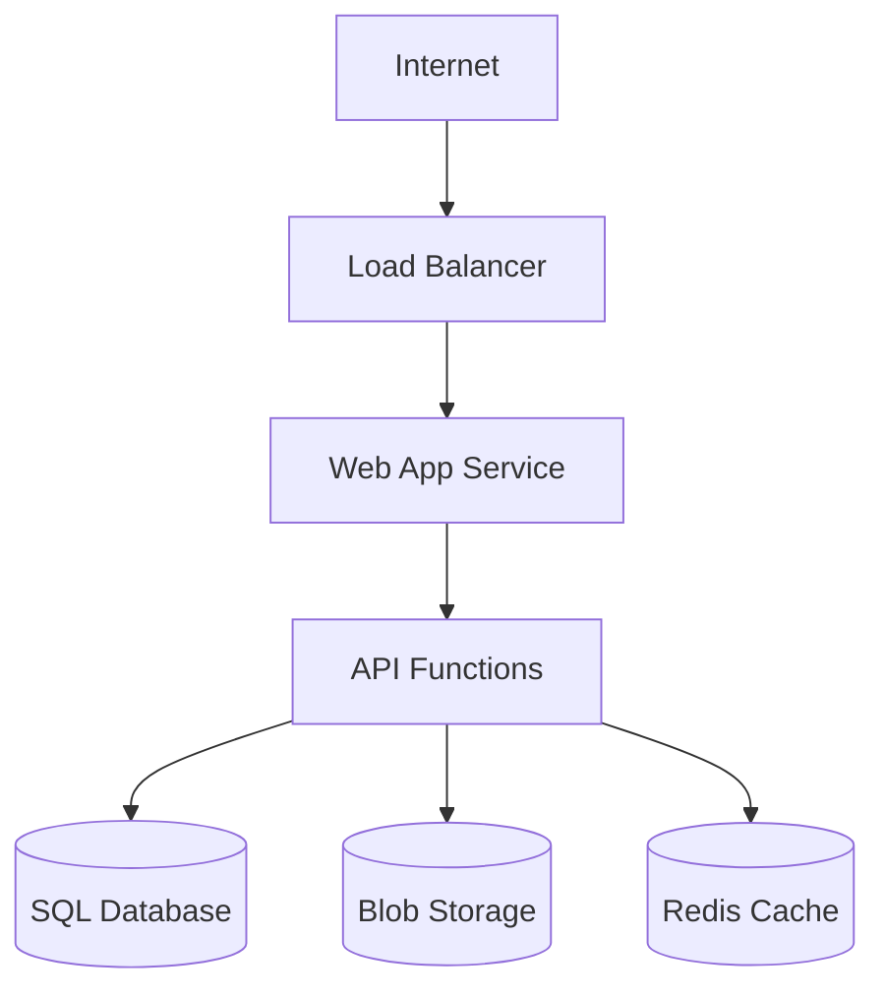

---
description:
  READ-ONLY cloud infrastructure analysis for Azure, AWS, GCP deployments
---

# Gofer Cloud

## Continuation And Stop Contract
<!-- gofer:continuation:start -->

1. Preserve the requested scope and mode, including read-only, plan-only, research-only and MVP work. Keep the full applicable pipeline, stage functions, artifacts, reviews and validation; do not expand an MVP into an unapproved release.
2. After a stage's required evidence is complete, read and follow the next internal file in .specify/commands/ in the same conversation. Do not require a numbered command or a host-specific skill dispatcher. Optional helpers remain optional; maintenance and control commands do not start delivery work.
3. After explicit business-specification approval, continue routine planning, tasks, implementation and validation within that approved scope. Record the approval source and scope; missing or ambiguous approval is not approval. A proposal or generated status is not user consent.
4. Preserve any explicit plan/task approval requirement unless it is already satisfied by recorded user approval covering that work. Rejected, revoked, changed or unclear approval requires a pause. Never invent approvedBy, approvedAt or a new approval event when reusing an existing approval.
5. Pause for material scope, security, cost, deployment, destructive or protected files/boundary changes and any outstanding user gate. Business approval does not authorize publishing, spending, external changes or bypassing host permissions. Complete safe authorized work without bypassing the blocked gate.
6. A tool proposal is not execution. If host consent is required, wait for it. After the tool result or approved proposal returns, inspect the result and resume the next authorized action within approved scope; do not end with only a plan or a proposed tool call. A denied tool or unavailable capability must not be bypassed through another host or CLI.
7. Use the current agent's available native tools. Optional Gofer/MCP tools are conveniences, not prerequisites. If the current agent lacks a required capability, report that limitation and the safe next action; do not pretend a handoff button transfers control automatically.
8. Stop after research only when research-only work was requested, the user paused, or a real gate blocks progress. Otherwise continue to specification. At validation, report completion only when the requested scope's required evidence passes; failures remain unfinished work.
9. Respect budget, context and retry limits from the existing loop contract. Repair safe within-scope failures only within those limits. Preserve a checkpoint before an orderly context stop; resume by reading its recorded stage and rechecking scope, approvals and evidence. Never claim an abrupt host termination was handled.
10. Report concise Progress during work. At every controlled stop, report Progress, Stop reason and Next action, including the exact missing input or approval and unfinished work. Reasons are requested scope complete, user pause, approval required, material change, missing capability/access, validation blocked, or budget/context/retry limit. Stage completion alone is not pipeline completion.

**Blocker Mediation**

- Before repeating a failed action or asking for missing input, read .specify/references/blocker-mediation.md and inspect the private blocker register with gofer-blocker-control.mjs. Reuse the same state directory and goal, subject and condition keys across stages, restarts and surfaces. Different wording, models or tools do not create a new blocker.
- Classify the cause first. Missing user decisions, access, external dependencies and unavailable capabilities require a recorded wait. Reserve an ask event before asking; ask once, explain the business impact and required change, then stop affected work. An unanswered question is not new evidence. Do not poll or rephrase it to keep running.
- Technical ask events require a fresh verification file under .specify/references/priority-outcome-protection.md: actual diagnosis, self-cause check and why no authorized repair is available. Business choices need no failed command. For feature tasks, use gofer-priority-check.mjs and the saved direction before switching work; this does not start delivery during maintenance or conversation.
- For AI-solvable or unknown causes, reserve each attempt before execution. Allow one investigation and one different recovery within existing tighter budgets. Record its result even when interrupted or unsuccessful. An unfinished reservation must not launch again. Do not reset the register, change keys or switch surfaces to obtain more attempts.
- Resume only after a real user answer or changed external evidence has been recorded and checked. The helper allows one evidence-backed resumption; exhausted limits need human review. Never invent approval or evidence. Successful model output and a running server do not resolve a blocker without the relevant check.
- Save the blocker, unfinished tasks and next action before stopping. Continue only approved tasks that do not depend on it. Keep the original goal; update specs, plans, tasks and validation for accepted direction changes, and reopen stale checks. Do not quietly drop requirements to make progress.
- Use node .specify/scripts/node/gofer-blocker-control.mjs --state-dir <private-state-directory> --event <private-event.json> before controlled actions; inspect with --state-dir alone, or add --task T001 for an independent task. A denied action, invalid record or missing helper means stop and explain the limitation, not bypass it. Use the installed plugin script path if no repo scaffold exists. Conversation-only work uses a private session state directory and does not require app setup or feature files.
- Strict loop validation checks every recorded feature blocker. Shared instructions guide native chats; this helper cannot intercept calls that a host sends directly. Do not claim native enforcement from package tests alone.
<!-- gofer:continuation:end -->

## MVP Capability-Based Validation

Use `.specify/references/mvp-capability-validation.md` as the source of
truth. Validate the work that the active feature specification requires now.
Do not apply later delivery requirements to an early MVP.

1. Create `.specify/specs/{feature}/` before app or operator-tool source work.
2. Keep `spec.md`, `plan.md`, `tasks.md`, `traceability.md`, and the validation scope aligned.
3. Mark each relevant capability as `not_applicable`, `planned`, `implemented`, `verified`, or `blocked`.
4. Require evidence only for an implemented capability or a capability required by the current delivery decision.
5. Treat `run.sh`, `run.bat`, and `run.ps1` as launch evidence only. They do not prove authentication, sessions, EAI access, or deployment readiness.
6. For a user-facing change, store the local HTTP check, screenshot, and review outcome in the feature validation report.
7. If browser validation is blocked, mark that user journey `unverified`. Do not call it complete.
8. If the user changes scope, update the feature artifacts before continuing. Explain what changed, what remains valid, and what now needs evidence.
9. Use truthful completion language. For example: `The server runs. Authentication is not in the current MVP scope.`
10. When the feature claims a release or deployed outcome, create `release-capability-ledger.md` from `.specify/templates/release-capability-ledger-template.md`.
11. Do not report a release complete or score 100% when a required capability is missing from traceability, remains on an open PR, is absent from the release branch, or lacks required deployed evidence.

## Application Classification And EAI Preflight

Before any EAI CLI, login, tenant, template, or app-enrollment action:

1. Classify the request as **EAI app delivery** or **non-application work** using the application signals in `.specify/commands/0_gofer_start.md`.
2. Create `.specify/specs/{feature}/` and record the active delivery scope before app or operator-tool source work.
3. If the request is clearly non-app work, confirm once: **"This looks like non-app work, so I will skip EAI tenant/app setup and continue the Gofer research/docs path. Is that right?"**
4. If the user confirms non-app, record the decision and mark app-only capabilities `not_applicable`. Do not run `eai whoami`, `eai tenant select`, `eai init`, or `/gofer:eai-first-run`.
5. For local MVP app work, validate the implemented user journey, repo runner, and preview evidence. Do not require EAI setup, authentication, or deployment when the active specification does not require them.
6. When the feature uses EAI Platform services, requires a tenant, or prepares deployment, run `eai whoami` and record the EAI readiness evidence in `eai-preflight.md`.
7. When the feature creates, changes, or validates an EAI Platform app integration, run `node .specify/scripts/node/eai-app-template-readiness.mjs --root . --json`. A missing checker or status other than `ready` blocks that EAI capability. It does not block unrelated local MVP work.
8. When authentication is implemented or required, validate provider, callback, sign-in, session, first protected API call, and safe denied access.
9. When deployment is requested or claimed, require the relevant EAI template, security, configuration, and deployment evidence before completion.
10. For durable app delivery, use EAI Platform first, Azure second, and every other stack only by explicit exception.
11. If the user changes scope, update `spec.md`, `plan.md`, `tasks.md`, `traceability.md`, and validation scope before continuing. Explain the business effect and evidence change.
12. Do not accept copied marker files, partial scaffolds, or custom templates as readiness evidence for an EAI capability.
13. Do not write tokens, secrets, private tenant IDs, or local `.env` values into Gofer artifacts; record only product-safe readiness status and evidence.

**Authentication Access Decision**

When adding or changing authentication, read `.specify/references/platform/eai-auth-access.md`. Ask: **"Who should be able to use this app: only members of its EAI workspace (recommended), or any authenticated EAI user?"** Default to `workspace-only`. Wait for the answer before changing auth code. An unanswered question must not widen access. Preserve stricter existing rules. Record the answer in the feature spec; do not repeat a confirmed question unless its scope changes.

Confirm the sign-in method separately: EAI sign-in or client SSO through EAI. Verify platform support and CLI syntax; do not invent SSO commands. Enforce trusted server-side workspace membership and app permissions. A session, CIAM directory ID, or email domain alone is not workspace access. Platform-wide sign-in never grants access to another workspace's data. Test allowed and denied users, revoked membership, unavailable membership checks, and cross-tenant requests. These checks apply only when authentication is implemented or required, not to non-app work or an auth-free local MVP.

## Token And Cost Policy
<!-- gofer:token-cost-policy:start -->

Before spawning agents, calling tools, or loading large files:

1. Treat `.specify/memory/gofer-model-policy.yaml` as the repo-owned source of truth for simple, medium, hard, and arbiter model routing. If it is missing, run `/gofer:bootstrap-workspace` before continuing.
2. Use the cheapest capable model first.
   - Claude: Haiku for scouting/extraction; Sonnet for normal implementation, synthesis, validation, and security; Opus for high-risk arbitration or release-critical failures.
   - Codex/OpenAI: GPT mini for simple coding; GPT nano only for locate/classify/summarize/mechanical work; GPT-5.3-Codex or flagship GPT for tool-heavy coding, architecture, and release-critical validation.
   - Gemini: Flash-Lite for cheap large-context scan/summarize; Flash for default research synthesis; Pro for large-context architecture or high-risk arbitration.
   - Copilot: prefer Auto for simple and default work; ask the user before choosing a paid/high-tier picker model for hard security, architecture, or release gates.
3. Keep raw tool output out of the main conversation context. Save stable findings to `.specify/specs/{feature}/context-bundle.md`, then work from summaries.
4. Use provider prompt/context caching only for stable, non-secret prefixes: Gofer scaffold, AGENTS/CLAUDE/Copilot instructions, constitution, repo map, stage contracts, and validation rubric.
5. Before continuing after large research, planning, implementation, or validation bursts, checkpoint the durable artifacts and compact/clear/resume context when the host supports it.
6. Escalate model tier only when a cheaper pass is low-confidence, contradictory, security-sensitive, or blocking release quality.
<!-- gofer:token-cost-policy:end -->

## Business-Friendly Progress Contract
<!-- gofer:business-progress:start -->

Default user-facing updates must be concise, business-level, and easy to scan.
Keep the technical work rigorous in artifacts, tests, logs, and code, but do
not lead with implementation jargon unless the user asks for it.

Use ASD-STE100 Simplified Technical English as the target writing standard for
all Gofer-authored chat, documents, commands, summaries, PR notes, error
guidance, and validation artifacts. ASD-STE100 is copyright and a trademark of
ASD; do not bundle the protected ASD dictionary and do not claim ASD
certification.

1. Explain progress as what is being connected, changed, checked, or fixed and
   why it matters to the business outcome.
2. Use the running build map: create or update
   `.specify/specs/{feature}/build-map.md` from
   `.specify/templates/build-map-template.md` for application delivery, and
   refer to its plain-language areas in progress updates.
3. When there is a problem, translate it into business impact, current status,
   next action, and what input or approval is needed. Keep raw stack traces,
   command logs, IDs, and acronyms out of chat unless asked.
4. If the user asks for technical depth, provide it on request and point to the
   durable artifact that contains the evidence.
5. Prefer a compact update shape:
   - `Working on`: the build-map area or stakeholder outcome
   - `Why it matters`: user/business impact
   - `Status`: done, checking, fixing, blocked, or needs decision
6. Use one action per instruction.
7. Keep instructions to 20 words or fewer where possible.
8. Use active voice unless the actor is unknown or not important.
9. Use simple verb forms: simple present, simple past, simple future,
   infinitive, or imperative.
10. Define acronyms on first use and use approved project terms.
11. Avoid idioms, marketing adjectives, vague praise, and hedging.
12. Use vertical lists for complex information and one topic per paragraph.
13. For errors, state what happened, why it matters, what to do next, and the
    exact safe command when one exists.
14. Do not remove technical validation, security checks, EAI preflights, tests,
   or loop evidence. This contract changes presentation, not engineering
   standards.
15. Before each user-facing reply, check that it leads with the business effect,
    uses concise simple language, and includes only useful technical detail.
16. If any check fails, rewrite the reply before sending it.
**Business Updates And Goal Checks**

Use `.specify/references/business-updates-and-goal-checks.md`. Before each reply, explain the result, business effect, and next action in plain language. For progress, use two or three short sentences. Run `node .specify/scripts/node/gofer-response-check.mjs --input <private-draft-file>` before sending a drafted progress update; rewrite failed drafts. Use `--kind answer` for answers and `--technical` only when technical detail was requested. Do not repeat unchanged progress. This helper cannot intercept messages that the host sends directly.

Before each work batch, read the current goal, specification, tasks, and latest findings. After new knowledge or an approved change, update affected feature documents and explain the effect. Never weaken acceptance criteria to match failing code or invent user approval. Mark a task complete only after its linked checks pass; reopen affected tasks when evidence is stale. For app and non-app features with a spec and tasks, enable `requireDeliveryCheckpoint` in `loop-contract.json` and run `node .specify/scripts/node/gofer-delivery-check.mjs --feature-dir <feature-dir>` before advancing or claiming completion. Follow the reference to capture a reviewed checkpoint, not merely to clear a failure. Keep existing MVP exemptions, reviews, loops, and release gates. Conversation-only requests need no feature files.

**Priority And Outcome Protection**

Follow `.specify/references/priority-outcome-protection.md`. Before implementing a task, record the latest material user direction in decisions.md and maintain priority-plan.json with ordered tasks, dependencies, allowedEditScope and the current outcome. Enable requirePriorityPlan for new feature contracts. Run `node .specify/scripts/node/gofer-priority-check.mjs --feature-dir <feature-dir> --task T001` before the action, and include --workspace <repo-root> plus --changed-file for each proposed or actual changed repo-relative path. Follow its nextTask; only recorded prerequisites and approved parallel work may precede the current priority. Do not switch to unrelated work when blocked. On resume, state the agreed outcome and next task in plain language after reading the last recorded direction. Keep routine conversation free of feature paperwork.

Before technical escalation, attach fresh diagnosis through the blocker helper's ask event verification field. Check the exact command, route, environment, own mistake and existing authority. Do not invent a tenant, ask for login without checking it, require an unsafe alternative, or equate administrator access with permission. Business decisions need no failing command. At completion, run the priority checker with --finish; a missing or stale outcome receipt means unverified, regardless of test scores. Use --completion for the final gofer-closed-loop-audit.mjs run; a routine drift audit alone does not prove completion. Preserve detailed test results, early local MVP scope, non-app work, independent approved tasks and all release/security checks.

<!-- gofer:business-progress:end -->

## App Preview Runner Contract
<!-- gofer:app-preview-runner:start -->

For EAI app delivery, every UI preview must use the repo runner when it exists.

1. Use `./run.sh dev 3001` on macOS, Linux, and GitHub Codespaces.
2. Use `run.bat dev 3001` on Windows.
3. Use a different port only when the feature notes record the reason.
4. Restart only this app. Before stopping a process, verify its exact checkout, process ID, start time and command, then recheck immediately before stopping it. Never stop another app, an unknown process, or every process on a port. If ownership is uncertain, leave it running and ask the user. Inspect older runners before use; do not run one that kills by port alone.
5. Do not use direct `npm run dev`, `next dev`, or package-manager preview commands when `run.sh`, `run.bat`, or `run.ps1` exists.
6. After every UI-facing change, run:
   - `node .specify/scripts/node/gofer-ui-preview.mjs --feature-dir {FEATURE_DIR} --command "./run.sh dev 3001" --open auto --screenshot --change "<change summary>"`
7. On Windows, use:
   - `node .specify/scripts/node/gofer-ui-preview.mjs --feature-dir {FEATURE_DIR} --command "run.bat dev 3001" --open auto --screenshot --change "<change summary>"`
8. If the runner is missing in an EAI app template repo, refresh the template before preview work continues.
9. Check the exact preview page and the current implemented user journey after each change. A running process, open browser, screenshot alone, error page or dry run is not proof that it works. Say ready to view only after those checks pass. Otherwise explain what is unchecked or failing; do not claim readiness. Record fresh browser and test evidence. Local MVP checks cover only implemented behaviour; do not add future auth or deployment gates. Keep showing clearly labelled drafts without adding approval stops.
<!-- gofer:app-preview-runner:end -->

## User Input

```text
$ARGUMENTS
```

You **MUST** consider the user input before proceeding (if not empty).

---

## SAFETY NOTICE

**This command only executes READ-ONLY cloud CLI operations.**

All commands are safe inspection operations that do not modify any cloud
resources. This is critical for agentic coding - agents must never accidentally
modify production infrastructure.

---

## When to Use This Command

- Understanding deployment architecture before feature work
- Analyzing costs and optimization opportunities
- Security and compliance audits
- Performance analysis
- Documenting existing infrastructure
- Planning infrastructure changes

---

## Step 1: Initial Setup

Ask the user:

```
I'm ready to analyze your cloud infrastructure. Please specify:
1. Which cloud platform (Azure/AWS/GCP/other)
2. What aspect to focus on (or "all" for comprehensive analysis):
   - Resources and architecture
   - Security and compliance
   - Cost optimization
   - Performance and scaling
   - Specific services or resource groups
```

Wait for user response.

---

## Step 2: Verify Cloud CLI Access

### Azure

```bash
# Check CLI installed
az version

# Verify authentication
az account show

# List subscriptions
az account list --output table
```

### AWS

```bash
# Check CLI installed
aws --version

# Verify authentication
aws sts get-caller-identity

# List profiles
aws configure list-profiles
```

### GCP

```bash
# Check CLI installed
gcloud version

# Verify authentication
gcloud auth list

# List projects
gcloud projects list
```

If not authenticated, guide user through login process.

---

## Step 3: Execute Cloud Inspection (READ-ONLY)

### Allowed Operations (SAFE)

- `list`, `show`, `describe`, `get` operations
- View configurations and settings
- Read metrics and logs
- Query costs and billing (read-only)
- Inspect security settings (without modifying)

### Forbidden Operations (NEVER EXECUTE)

- Any command with: `create`, `delete`, `update`, `set`, `put`, `post`, `patch`,
  `remove`
- Starting/stopping services or resources
- Scaling operations
- Backup or restore operations
- IAM modifications
- Configuration changes

---

## Step 4: Systematic Resource Inspection

### 4.1 Compute Resources

**Azure:**

```bash
az vm list --output table
az container list --output table
az functionapp list --output table
az webapp list --output table
```

**AWS:**

```bash
aws ec2 describe-instances --output table
aws ecs list-clusters
aws lambda list-functions
aws elasticbeanstalk describe-environments
```

**GCP:**

```bash
gcloud compute instances list
gcloud run services list
gcloud functions list
gcloud app instances list
```

### 4.2 Storage Resources

**Azure:**

```bash
az storage account list --output table
az cosmosdb list --output table
az sql server list --output table
```

**AWS:**

```bash
aws s3 ls
aws dynamodb list-tables
aws rds describe-db-instances
```

**GCP:**

```bash
gcloud storage buckets list
gcloud firestore databases list
gcloud sql instances list
```

### 4.3 Networking

**Azure:**

```bash
az network vnet list --output table
az network nsg list --output table
az network lb list --output table
az network application-gateway list --output table
```

**AWS:**

```bash
aws ec2 describe-vpcs
aws ec2 describe-security-groups
aws elbv2 describe-load-balancers
aws apigateway get-rest-apis
```

**GCP:**

```bash
gcloud compute networks list
gcloud compute firewall-rules list
gcloud compute forwarding-rules list
```

### 4.4 Security Analysis

**Azure:**

```bash
az role assignment list --output table
az keyvault list --output table
az network nsg rule list --nsg-name [name] --resource-group [rg]
```

**AWS:**

```bash
aws iam list-users
aws iam list-roles
aws kms list-keys
aws secretsmanager list-secrets
```

**GCP:**

```bash
gcloud iam roles list
gcloud kms keyrings list --location global
gcloud secrets list
```

### 4.5 Cost Analysis

**Azure:**

```bash
az consumption usage list --start-date [date] --end-date [date]
az advisor recommendation list --category Cost
```

**AWS:**

```bash
aws ce get-cost-and-usage --time-period Start=[date],End=[date] --granularity MONTHLY --metrics BlendedCost
aws ce get-reservation-utilization --time-period Start=[date],End=[date]
```

**GCP:**

```bash
gcloud billing accounts list
gcloud recommender recommendations list --project=[project] --location=global --recommender=google.compute.instance.MachineTypeRecommender
```

---

## Step 5: Generate Cloud Research Document

Write to `{FEATURE_DIR}/cloud-analysis.md` (or `.specify/cloud/[environment].md`
for general analysis):

````markdown
---
date: [ISO timestamp]
researcher: Gofer
platform: [Azure/AWS/GCP]
environment: [Production/Staging/Dev]
subscription: [Subscription/Account ID]
status: complete
---

# Cloud Infrastructure Analysis: [Environment Name]

## Executive Summary

[High-level findings, critical issues, and key recommendations]

## Analysis Scope

- **Platform**: [Cloud Provider]
- **Subscription/Project**: [ID]
- **Regions**: [List]
- **Focus Areas**: [What was analyzed]

## Resource Inventory

| Category   | Resource Type | Count | Region  | Est. Monthly Cost |
| ---------- | ------------- | ----- | ------- | ----------------- |
| Compute    | VMs           | 12    | East US | $1,200            |
| Compute    | Functions     | 5     | East US | $50               |
| Storage    | Blob Storage  | 3     | East US | $200              |
| Database   | SQL Server    | 2     | East US | $800              |
| Networking | Load Balancer | 1     | East US | $100              |

**Total Estimated Monthly Cost**: $X,XXX

## Architecture Overview


````

## Detailed Findings

### Compute Infrastructure

| Resource      | Type     | Size        | State   | Notes         |
| ------------- | -------- | ----------- | ------- | ------------- |
| prod-web-01   | VM       | Standard_D4 | Running | Web server    |
| prod-api-func | Function | Consumption | Active  | API endpoints |

**Observations**:

- [Finding about compute resources]
- [Optimization opportunity]

### Data Layer

| Resource  | Type    | Size  | Tier     | Backup Status |
| --------- | ------- | ----- | -------- | ------------- |
| prod-sql  | SQL DB  | 50GB  | Standard | Daily         |
| prod-blob | Storage | 200GB | Hot      | GRS enabled   |

**Observations**:

- [Finding about data resources]
- [Compliance consideration]

### Networking

| Resource  | Type | Configuration        | Security     |
| --------- | ---- | -------------------- | ------------ |
| prod-vnet | VNet | 10.0.0.0/16          | NSG attached |
| prod-lb   | LB   | Standard, Zone-aware | HTTPS only   |

**Observations**:

- [Network topology findings]
- [Security considerations]

## Security Analysis

### IAM Review

| Principal | Role        | Scope        | Risk Level |
| --------- | ----------- | ------------ | ---------- |
| dev-team  | Contributor | Subscription | Medium     |
| ci-cd-sp  | Owner       | Resource Grp | High       |

### Security Findings

| Finding               | Severity | Resource        | Recommendation  |
| --------------------- | -------- | --------------- | --------------- |
| Public blob container | High     | storage-account | Enable private  |
| Open SSH port         | Medium   | prod-web-01     | Restrict to VPN |
| Missing encryption    | Medium   | prod-sql        | Enable TDE      |

### Compliance Status

- [ ] Encryption at rest enabled
- [ ] Encryption in transit enforced
- [ ] Backup retention meets policy
- [ ] Access logging enabled
- [ ] Network segmentation in place

## Cost Analysis

### Current Monthly Cost: $X,XXX

| Category   | Cost   | % of Total |
| ---------- | ------ | ---------- |
| Compute    | $1,250 | 50%        |
| Storage    | $200   | 8%         |
| Database   | $800   | 32%        |
| Networking | $250   | 10%        |

### Optimization Opportunities

| Opportunity           | Current   | Recommended | Savings |
| --------------------- | --------- | ----------- | ------- |
| Right-size VMs        | D4 x 2    | D2 x 2      | $400/mo |
| Reserved instances    | On-demand | 1-year RI   | $300/mo |
| Delete unused storage | 50GB      | 0GB         | $25/mo  |

**Potential Monthly Savings**: $725

## Risk Assessment

### Critical Issues

1. **[Issue]**: [Description and impact]
2. **[Issue]**: [Description and impact]

### Warnings

1. **[Warning]**: [Description and recommendation]
2. **[Warning]**: [Description and recommendation]

## Recommendations

### Immediate Actions (This Week)

1. [ ] [Security fix or critical issue]
2. [ ] [Another urgent item]

### Short-term Improvements (This Month)

1. [ ] [Cost optimization]
2. [ ] [Performance enhancement]

### Long-term Strategy (This Quarter)

1. [ ] [Architecture improvement]
2. [ ] [Migration consideration]

## CLI Commands for Verification

```bash
# Key commands used in this analysis
az vm list --output table
az storage account list --output table
# ... other commands run
```

## Integration with Feature Development

If analyzing for a specific feature:

### Deployment Target

- **Environment**: [Where feature will deploy]
- **Resource Group**: [Target RG]
- **Required Services**: [What feature needs]

### Constraints for Implementation

- [Constraint 1]: How this affects the feature
- [Constraint 2]: Another consideration

### Infrastructure Changes Needed

- [ ] [New resource needed]
- [ ] [Configuration change]
- [ ] [Permission update]

```

---

## Step 6: Report Completion

```

================================================================ CLOUD ANALYSIS
COMPLETE: [Environment Name]
================================================================

Platform: [Azure/AWS/GCP] Resources Analyzed: [N] resources across [N]
categories

Key Findings:

- [Critical finding 1]
- [Warning 1]
- [Optimization opportunity]

Cost Summary:

- Current: $X,XXX/month
- Potential Savings: $XXX/month

Security Status:

- Critical Issues: [N]
- Warnings: [N]
- Compliance: [X]/[Total] checks passed

Report: [output file path]

Recommended Actions:

1. [Most important action]
2. [Second priority]

================================================================

```

---

## Error Handling

### CLI Not Installed

```

[Platform] CLI not found. Please install:

Azure: https://docs.microsoft.com/cli/azure/install-azure-cli AWS:
https://aws.amazon.com/cli/ GCP: https://cloud.google.com/sdk/docs/install

```

### Not Authenticated

```

Not authenticated to [Platform]. Please run:

Azure: az login AWS: aws configure GCP: gcloud auth login

```

### Insufficient Permissions

```

Warning: Insufficient permissions for some operations. Missing permissions:
[list]

Analysis will continue with available access. Results may be incomplete for:
[affected areas]

````

### Rate Limited

If rate limited, implement exponential backoff and continue with available data.

---

## Observability Logging

```bash
.specify/scripts/bash/log-stage.sh 10_cloud --complete --tokens [N] --compactions [N]
````

---

## Key Rules

- **READ-ONLY OPERATIONS ONLY** - never create, modify, or delete
- **Always verify CLI authentication** before running commands
- **Use --output json** for structured data parsing
- **Handle API rate limits** by spacing requests
- **Respect security** - never expose sensitive data in reports
- **Generate actionable insights**, not just resource lists

## Local Settings Cleanup Contract
<!-- gofer:local-settings-cleanup:start -->

After any Gofer install, update, release refresh, or workspace bootstrap:

1. Archive stale Gofer command and skill entries before continuing.
2. Prefer the repo helper:
   - `node .specify/scripts/node/gofer-local-settings-cleanup.mjs --workspace . --apply --json`
3. If the repo helper is missing, use the stable plugin bundle helper:
   - macOS/Linux: `node ~/plugins/eai-gofer/.specify/scripts/node/gofer-local-settings-cleanup.mjs --workspace . --apply --json`
   - Windows: `node %USERPROFILE%\plugins\eai-gofer\.specify\scripts\node\gofer-local-settings-cleanup.mjs --workspace . --apply --json`
4. This cleanup covers old Claude, Codex, Copilot, Gemini, Grok, VS Code, desktop, and CLI command surfaces.
5. Do not remove the current public `eai` entrypoint.
6. Ask the user to refresh or restart the host command picker only after cleanup completes.
<!-- gofer:local-settings-cleanup:end -->
