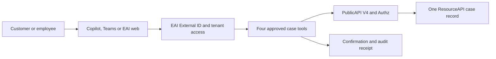

# Build Map: Microsoft Teams And Copilot Starter Kit

| Area | Status | Current work | Business impact |
| --- | --- | --- | --- |
| Customer journey | Ready | Customer Case Assistant selected | One simple story demonstrates the complete proposition |
| Web experience | Planned | Template-derived case dashboard | Non-Copilot users retain equivalent access |
| Teams and Copilot | Planned | Declarative agent and OpenAPI package | EAI work is available in Microsoft channels |
| Identity and tenant security | Ready boundary | Reuse External ID, PublicAPI and Authz | External users do not weaken tenant isolation |
| Data | Planned | Synthetic demo then dedicated DEV harness | No customer data is used for public demonstration |
| Validation | Planned | Contract, UI, package and live-state gates | Mock success cannot be presented as live proof |

## Latest Update

- **Working on**: repository foundation and contract-first tests
- **Why it matters**: the starter must demonstrate real EAI value without customer risk
- **Status**: planned and approved for implementation
- **Next**: create the repository and make the synthetic case journey work

