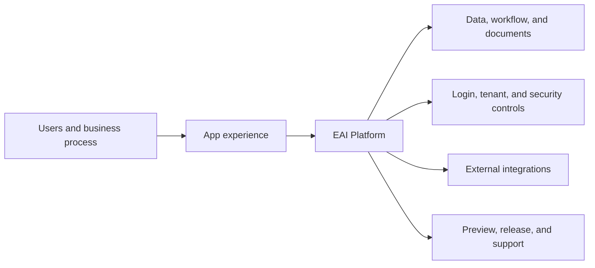

# Build Map: {{feature-name}}

## How To Read This

This is the simple picture Gofer uses to explain what is being built. Each
update should point back to one area below so non-technical stakeholders can see
where work is happening, what is healthy, and what needs a decision.

## One-Page Build Picture

## Current Status

| Area                                 | What it means in plain language                             | Status        | Current work | Issue / fix | Business impact |
| ------------------------------------ | ----------------------------------------------------------- | ------------- | ------------ | ----------- | --------------- | ---------------- | ----------------- | ---------- |
| Users and business process           | Who this helps and what process improves                    | {{not-started | working      | ready       | blocked}}       | {{current-work}} | {{issue-or-none}} | {{impact}} |
| App experience                       | Screens, forms, guidance, and user flow                     | {{not-started | working      | ready       | blocked}}       | {{current-work}} | {{issue-or-none}} | {{impact}} |
| EAI Platform                         | App template, object types, workflow, and platform services | {{not-started | working      | ready       | blocked}}       | {{current-work}} | {{issue-or-none}} | {{impact}} |
| Data, workflow, and documents        | Information captured, processed, stored, and reported       | {{not-started | working      | ready       | blocked}}       | {{current-work}} | {{issue-or-none}} | {{impact}} |
| Login, tenant, and security controls | Who can access the app and how sensitive data is protected  | {{not-started | working      | ready       | blocked}}       | {{current-work}} | {{issue-or-none}} | {{impact}} |
| External integrations                | Systems connected to the app                                | {{not-started | working      | ready       | blocked}}       | {{current-work}} | {{issue-or-none}} | {{impact}} |
| Preview, release, and support        | How users see it, test it, and receive updates              | {{not-started | working      | ready       | blocked}}       | {{current-work}} | {{issue-or-none}} | {{impact}} |

## Latest Plain-Language Update

- **Working on**: {{build-map-area}}
- **Why it matters**: {{business-reason}}
- **Status**: {{done|checking|fixing|blocked|needs-decision}}
- **What happens next**: {{next-step}}

## Technical Detail On Request

| Evidence                             | Where to find it                                   |
| ------------------------------------ | -------------------------------------------------- |
| Requirements and acceptance criteria | `spec.md`                                          |
| Architecture and platform decisions  | `plan.md`, `cto-architecture-summary.md`           |
| EAI readiness and setup              | `eai-preflight.md`, `service-fit-matrix.md`        |
| UI preview and feedback              | `ui-show-and-tell.md`, `ui-review-log.md`          |
| Security and validation              | `validation-report.md`, `ciso-security-summary.md` |
